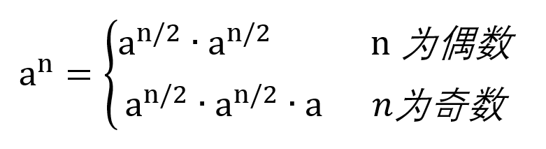
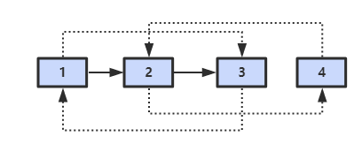
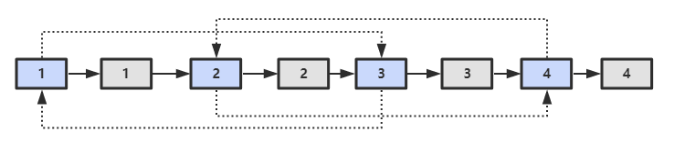
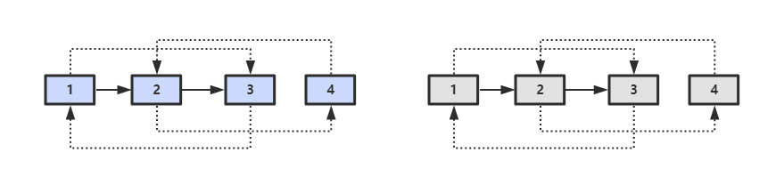

# 《剑指 Offer》

## 3.1 找出数组中重复的数

来源：[AcWing](https://www.acwing.com/problem/content/14/)

### 题目描述

给定一个长度为 `n` 的整数数组 `nums`，数组中所有的数字都在 `0∼n−1` 的范围内。

数组中某些数字是重复的，但不知道有几个数字重复了，也不知道每个数字重复了几次。

请找出数组中任意一个重复的数字。

**注意**：如果某些数字不在 `0∼n−1` 的范围内，或数组中不包含重复数字，则返回 `-1`；

**样例**

```
给定 nums = [2, 3, 5, 4, 3, 2, 6, 7]。

返回 2 或 3。
```

### 解法

从题目我们可以知道，数组长度为 n，所有数字都在 `0~n-1` 范围内。如果元素不重复，那么数组应该就是 `[0, 1, 2, ...n-1]`（假设给数组排完了序）。也就是说，递增排序后，数组中的元素值与其对应的下标应该是相同的，即下标为 0 的元素值也是 0，以此类推。

首先，我们可以遍历数组，若存在元素不在 `0~n-1` 的范围内，直接返回 -1。

接着，再次遍历数组，若下标 `i` 与对应元素 `nums[i]` 不同，即 `nums[i] != i`，我们应该把 `nums[i]` 这个元素交换到正确的位置 `nums[i]`上。交换前，先判断 `nums[i]` 与 `nums[nums[i]]` 这两个元素是否相同，相同说明存在重复元素，直接返回，否则进行 swap 交换。交换过后，我们需要再次判断 i 位置上的元素，因此，我们使用 while 循环。

可对照下方代码实现，加深理解。

```java
class Solution {

    /**
     * 查找数组中的重复元素
     *
     * @param nums 数组
     * @return 其中一个重复的元素
     */
    public int duplicateInArray(int[] nums) {
        int n = nums.length;

        // 若存在数组元素不在[0, n-1] 的范围内，直接返回-1
        for (int num : nums) {
            if (num < 0 || num >= n) {
                return -1;
            }
        }

        for (int i = 0; i < n; ++i) {
            while (nums[i] != i) {
                if (nums[i] == nums[nums[i]]) {
                    // 说明位置i与位置nums[i]上的元素相同，直接返回该重复元素
                    return nums[i];
                }
                swap(nums, i, nums[i]);
            }
        }
        return -1;

    }

    private void swap(int[] nums, int i, int j) {
        int t = nums[i];
        nums[i] = nums[j];
        nums[j] = t;
    }
}
```

## 3.2 不修改数组找出重复的数字

来源：[AcWing](https://www.acwing.com/problem/content/15/)

### 题目描述

给定一个长度为 `n+1` 的数组 `nums`，数组中所有的数均在 `1∼n` 的范围内，其中 `n≥1`。

请找出数组中任意一个重复的数，但不能修改输入的数组。

**样例**

```
给定 nums = [2, 3, 5, 4, 3, 2, 6, 7]。

返回 2 或 3。
```

**思考题**：如果只能使用 `O(1)` 的额外空间，该怎么做呢？

### 解法

#### 解法一

创建长度为 `n+1` 的辅助数组，把原数组的元素复制到辅助数组中。如果原数组被复制的数是 `m`，则放到辅助数组第 `m` 个位置。这样很容易找出重复元素。空间复杂度为 `O(n)`。

#### 解法二

数组元素的取值范围是 `[1, n]`，对该范围对半划分，分成 `[1, middle]`, `[middle+1, n]`。计算数组中有多少个(count)元素落在 `[1, middle]` 区间内，如果 count 大于 middle-1+1，那么说明这个范围内有重复元素，否则在另一个范围内。继续对这个范围对半划分，继续统计区间内元素数量。

时间复杂度 `O(n * log n)`，空间复杂度 `O(1)`。

注意，此方法无法找出所有重复的元素。

```java
class Solution {

    /**
     * 不修改数组查找重复的元素，没有则返回0
     *
     * @param nums 数组
     * @return 重复的元素
     */
    public int duplicateInArray(int[] nums) {
        if (nums == null || nums.length < 2) {
            return 0;
        }
        int start = 1, end = nums.length - 1;
        while (start <= end) {
            int mid = start + ((end - start) >> 1);
            int cnt = getCountRange(nums, start, mid);
            if (start == end) {
                if (cnt > 1) {
                    // 找到重复的数字
                    return start;
                }
                break;
            }
            if (cnt > mid - start + 1) {
                end = mid;
            } else {
                start = mid + 1;
            }
        }
        return 0;
    }

    /**
     * 计算整个数组中有多少个数的取值在[from, to] 之间
     *
     * @param nums 数组
     * @param from 左边界
     * @param to 右边界
     * @return 数量
     */
    private int getCountRange(int[] nums, int from, int to) {
        int cnt = 0;
        for (int e : nums) {
            if (e >= from && e <= to) {
                ++cnt;
            }
        }
        return cnt;
    }
}
```

## 4 二维数组中的查找

来源：[AcWing](https://www.acwing.com/problem/content/16/)

### 题目描述

在一个二维数组中，每一行都按照从左到右递增的顺序排序，每一列都按照从上到下递增的顺序排序。

请完成一个函数，输入这样的一个二维数组和一个整数，判断数组中是否含有该整数。

**样例**

```
输入数组：

[
  [1,2,8,9]，
  [2,4,9,12]，
  [4,7,10,13]，
  [6,8,11,15]
]

如果输入查找数值为7，则返回true，

如果输入查找数值为5，则返回false。
```

### 解法

从二维数组的右上方开始查找：

- 若元素值等于 `target`，返回 `true`；
- 若元素值大于 `target`，砍掉这一列，即 `--j`；
- 若元素值小于 `target`，砍掉这一行，即 `++i`。

也可以从二维数组的左下方开始查找，以下代码使用左下方作为查找的起点。

注意，不能选择左上方或者右下方的数字，因为这样无法缩小查找的范围。

```java
class Solution {

    /**
     * 二维数组中的查找
     *
     * @param array 二维数组
     * @param target 要查找的值
     * @return 是否找到该值
     */
    public boolean searchArray(int[][] array, int target) {
        if (array == null || array.length < 1) {
            return false;
        }
        int m = array.length, n = array[0].length;
        int i = 0, j = n - 1;
        while (i < m && j >= 0) {
            if (array[i][j] == target) {
                return true;
            }
            if (array[i][j] < target) {
                ++i;
            } else {
                --j;
            }
        }
        return false;
    }
}
```

## 5 替换空格

来源：[AcWing](https://www.acwing.com/problem/content/17/)

### 题目描述

请实现一个函数，把字符串中的每个空格替换成 `"%20"`。

你可以假定输入字符串的长度最大是 `1000`。
注意输出字符串的长度可能大于 `1000`。

**样例**

```
输入："We are happy."

输出："We%20are%20happy."
```

### 解法

#### 解法一

利用正则匹配替换。

```java
class Solution {

    /**
     * 将字符串中的所有空格替换为%20
     *
     * @param str 字符串
     * @return 替换后的字符串
     */
    public String replaceSpaces(StringBuffer str) {
        return str == null ? null : str.toString().replaceAll(" ", "%20");
    }
}
```

#### 解法二

先遍历原字符串，遇到空格，则在原字符串末尾 `append` 任意两个字符，如两个空格。

用指针 `i` 指向原字符串末尾，`j` 指向现字符串末尾，`i`, `j` 从后往前遍历，当 `i` 遇到空格，`j` 位置依次要赋值为 `'0','2','%'`，若不是空格，直接赋值为 `i` 指向的字符。

**思路扩展：**

在合并两个数组（包括字符串）时，如果从前往后复制每个数字（或字符）需要重复移动数字（或字符）多次，那么我们可以考虑**从后往前**复制，这样就能减少移动的次数，从而提高效率。

```java
class Solution {

    /**
     * 将字符串中的所有空格替换为%20
     *
     * @param str 字符串
     * @return 替换后的字符串
     */
    public String replaceSpaces(StringBuffer str) {
        if (str == null) {
            return null;
        }

        int len = str.length();
        for (int i = 0; i < len; ++i) {
            if (str.charAt(i) == ' ') {
                str.append("  ");
            }
        }

        int i = len - 1, j = str.length() - 1;
        for (; i >= 0; --i) {
            char ch = str.charAt(i);
            if (ch == ' ') {
                str.setCharAt(j--, '0');
                str.setCharAt(j--, '2');
                str.setCharAt(j--, '%');
            } else {
                str.setCharAt(j--, ch);
            }
        }
        return str.toString();
    }
}
```

## 6 从尾到头打印链表

来源：[AcWing](https://www.acwing.com/problem/content/18/)

### 题目描述

输入一个链表的头结点，按照 从尾到头 的顺序返回节点的值。

返回的结果用数组存储。

**样例**

```
输入：[2, 3, 5]
返回：[5, 3, 2]
```

### 解法

遍历链表，每个链表结点值 `push` 进栈，最后将栈中元素依次 `pop` 到数组中。

```java
/**
 * Definition for singly-linked list.
 * class ListNode {
 *     int val;
 *     ListNode next;
 *     ListNode(int x) { val = x; }
 * }
 */
class Solution {

    /**
     * 从尾到头打印链表
     *
     * @param head 链表头结点
     * @return 结果数组
     */
    public int[] printListReversingly(ListNode head) {
        if (head == null) {
            return null;
        }
        Stack<Integer> stack = new Stack<>();
        ListNode cur = head;
        int cnt = 0;
        while (cur != null) {
            stack.push(cur.val);
            cur = cur.next;
            ++cnt;
        }

        int[] res = new int[cnt];
        int i = 0;
        while (!stack.isEmpty()) {
            res[i++] = stack.pop();
        }
        return res;
    }
}
```

## 7 重建二叉树

来源：[AcWing](https://www.acwing.com/problem/content/23/)

### 题目描述

输入一棵二叉树前序遍历和中序遍历的结果，请重建该二叉树。

**样例**

```
给定：
前序遍历是：[3, 9, 20, 15, 7]
中序遍历是：[9, 3, 15, 20, 7]

返回：[3, 9, 20, null, null, 15, 7, null, null, null, null]
返回的二叉树如下所示：
    3
   / \
  9  20
    /  \
   15   7
```

### 解法

在二叉树的前序遍历序列中，第一个数字总是根结点的值。在中序遍历序列中，根结点的值在序列的中间，左子树的结点位于根结点左侧，而右子树的结点位于根结点值的右侧。

遍历中序序列，找到根结点，递归构建左子树与右子树。

注意添加特殊情况的 `if` 判断。

```java
/**
 * Definition for a binary tree node.
 * class TreeNode {
 *     int val;
 *     TreeNode left;
 *     TreeNode right;
 *     TreeNode(int x) { val = x; }
 * }
 */
class Solution {

    /**
     * 重建二叉树
     *
     * @param preorder 前序遍历序列
     * @param inorder 中序遍历序列
     * @return 二叉树根结点
     */
    public TreeNode buildTree(int[] preorder, int[] inorder) {
        if (preorder == null || inorder == null || preorder.length == 0 || preorder.length != inorder.length) {
            return null;
        }

        return build(preorder, inorder, 0, preorder.length - 1, 0, inorder.length - 1);
    }

    private TreeNode build(int[] preorder, int[] inorder, int s1, int e1, int s2, int e2) {
        int rootVal = preorder[s1];
        TreeNode root = new TreeNode(rootVal);
        if (s1 == e1) {
            return root;
        }

        int i = s2, cnt = 0;
        for (; i <= e2; ++i) {
            if (inorder[i] == rootVal) {
                break;
            }
            ++cnt;
        }

        root.left = cnt > 0 ? build(preorder, inorder, s1 + 1, s1 + cnt, s2, i - 1) : null;
        root.right = i < e2 ? build(preorder, inorder, s1 + cnt + 1, e1, i + 1, e2) : null;
        return root;
    }
}
```

## 8 二叉树的下一个节点

来源：[AcWing](https://www.acwing.com/problem/content/31/)

### 题目描述

给定一棵二叉树的其中一个节点，请找出中序遍历序列的下一个节点。

**注意：**

- 如果给定的节点是中序遍历序列的最后一个，则返回空节点;
- 二叉树一定不为空，且给定的节点一定不是空节点。

**样例**

```
假定二叉树是：[2, 1, 3, null, null, null, null]， 给出的是值等于 2 的节点。

则应返回值等于 3 的节点。

解释：该二叉树的结构如下，2 的后继节点是 3。
  2
 / \
1   3
```

### 解法

对于结点 `p`：

- 如果它有右子树，则**右子树的最左结点**就是它的下一个结点；
- 如果它没有右子树，判断它与父结点 `p.father` 的位置情况：
  - 如果它是父结点的左孩子，那么父结点 `p.father` 就是它的下一个结点；
  - 如果它是父结点的右孩子，一直向上寻找，直到找到某个结点，它是它父结点的左孩子，那么该父结点就是 `p` 的下一个结点。

```java
/**
 * Definition for a binary tree node.
 * public class TreeNode {
 *     int val;
 *     TreeNode left;
 *     TreeNode right;
 *     TreeNode father;
 *     TreeNode(int x) { val = x; }
 * }
 */
class Solution {

    /**
     * 获取二叉树中序遍历结点的下一个结点
     *
     * @param p 某结点
     * @return p的下一个结点
     */
    public TreeNode inorderSuccessor(TreeNode p) {
        if (p == null) {
            return null;
        }

        TreeNode cur = p.right;

        // 右子树不为空
        if (cur != null) {
            while (cur.left != null) {
                cur = cur.left;
            }
            return cur;
        }

        // 右子树为空
        TreeNode father = p.father;
        while (father != null && father.left != p) {
            p = father;
            father = p.father;
        }
        return father;
    }
}
```

## 9.1 用两个栈实现队列

来源：[AcWing](https://www.acwing.com/problem/content/36/)

### 题目描述

请用栈实现一个队列，支持如下四种操作：

- push(x) – 将元素 x 插到队尾。
- pop(x) – 将队首的元素弹出，并返回该元素。
- peek() – 返回队首元素。
- empty() – 返回队列是否为空。

**注意：**

- 你只能使用栈的标准操作：`push to top`，`peek/pop from top`, `size` 和 `is empty`；
- 如果你选择的编程语言没有栈的标准库，你可以使用 list 或者 deque 等模拟栈的操作；
- 输入数据保证合法，例如，在队列为空时，不会进行 `pop` 或者 `peek` 等操作；

**样例**

```java
MyQueue queue = new MyQueue();

queue.push(1);
queue.push(2);
queue.peek();  // returns 1
queue.pop();   // returns 1
queue.empty(); // returns false
```

### 解法

`push` 操作，每次都存入 `s1`；
`pop` 操作，每次从 `s2` 取：

- `s2` 栈不为空时，不能将 `s1` 元素倒入；
- `s2` 栈为空时，需要一次将 `s1` 元素全部倒入。

```java
class MyQueue {

    private Stack<Integer> s1;
    private Stack<Integer> s2;

    /** Initialize your data structure here. */
    public MyQueue() {
        s1 = new Stack<>();
        s2 = new Stack<>();
    }

    /** Push element x to the back of queue. */
    public void push(int x) {
        s1.push(x);
    }

    /** Removes the element from in front of queue and returns that element. */
    public int pop() {
        int t = peek();
        s2.pop();
        return t;
    }

    /** Get the front element. */
    public int peek() {
        if (s2.isEmpty()) {
            while (!s1.isEmpty()) {
                s2.push(s1.pop());
            }
        }
        return s2.peek();
    }

    /** Returns whether the queue is empty. */
    public boolean empty() {
        return s1.isEmpty() && s2.isEmpty();
    }
}

/**
 * Your MyQueue object will be instantiated and called as such:
 * MyQueue obj = new MyQueue();
 * obj.push(x);
 * int param_2 = obj.pop();
 * int param_3 = obj.peek();
 * boolean param_4 = obj.empty();
 */
```

## 9.2 用两个队列实现栈

来源：[LeetCode](https://leetcode.cn/problems/implement-stack-using-queues/)

### 题目描述

使用队列实现栈的下列操作：

- push(x) -- 元素 x 入栈
- pop() -- 移除栈顶元素
- top() -- 获取栈顶元素
- empty() -- 返回栈是否为空

**注意:**

- 你只能使用队列的基本操作-- 也就是 `push to back`, `peek/pop from front`, `size`, 和 `is empty` 这些操作是合法的。
- 你所使用的语言也许不支持队列。 你可以使用 list 或者 deque（双端队列）来模拟一个队列 , 只要是标准的队列操作即可。
- 你可以假设所有操作都是有效的（例如, 对一个空的栈不会调用 pop 或者 top 操作）。

### 解法

- 出栈时，先将队列的元素依次移入另一个队列中，直到队列剩下一个元素。将该元素出队即可。
- 进栈时，将元素压入不为空的那一个队列即可。如果两队列都为空，随便压入其中一个队列。

```java
class MyStack {

    private Queue<Integer> q1;
    private Queue<Integer> q2;

    /** Initialize your data structure here. */
    public MyStack() {
        q1 = new LinkedList<>();
        q2 = new LinkedList<>();
    }

    /** Push element x onto stack. */
    public void push(int x) {
        if (empty() || q2.isEmpty()) {
            q1.offer(x);
        } else {
            q2.offer(x);
        }
    }

    /** Removes the element on top of the stack and returns that element. */
    public int pop() {
        if (q1.isEmpty()) {
            while (q2.size() > 1) {
                q1.offer(q2.poll());
            }
            return q2.poll();
        }

        while (q1.size() > 1) {
            q2.offer(q1.poll());
        }
        return q1.poll();
    }

    /** Get the top element. */
    public int top() {
        int val = pop();
        push(val);
        return  val;
    }

    /** Returns whether the stack is empty. */
    public boolean empty() {
        return q1.isEmpty() && q2.isEmpty();
    }
}

/**
 * Your MyStack object will be instantiated and called as such:
 * MyStack obj = new MyStack();
 * obj.push(x);
 * int param_2 = obj.pop();
 * int param_3 = obj.top();
 * boolean param_4 = obj.empty();
 */
```

## 10.1 斐波那契数列

来源：[AcWing](https://www.acwing.com/problem/content/19/)

### 题目描述

输入一个整数 n ，求斐波那契数列的第 n 项。

假定从 0 开始，第 0 项为 0。`(n<=39)`

**样例**

```
输入整数 n=5

返回 5
```

### 解法

#### 解法一

采用递归方式，简洁明了，但效率很低，存在大量的重复计算。

```
                  f(10)
               /        \
            f(9)         f(8)
          /     \       /    \
       f(8)     f(7)  f(7)   f(6)
      /   \     /   \
   f(7)  f(6)  f(6) f(5)
```

```java
class Solution {

    /**
     * 求斐波那契数列的第n项，n从0开始
     *
     * @param n 第n项
     * @return 第n项的值
     */
    public int Fibonacci(int n) {
        if (n < 2) {
            return n;
        }
        return Fibonacci(n - 1) + Fibonacci(n - 2);
    }
}
```

#### 解法二

从下往上计算，递推，时间复杂度 `O(n)`。可以用数组存储，空间复杂度 `O(n)`；也可以用变量存储，空间复杂度 `O(1)`。

```java
class Solution {

    /**
     * 求斐波那契数列的第n项，n从0开始
     *
     * @param n 第n项
     * @return 第n项的值
     */
    public int Fibonacci(int n) {
        if (n < 2) {
            return n;
        }

        int a = 1, b = 1;
        for (int i = 2; i < n; ++i) {
            b = a + b;
            a = b - a;
        }
        return b;
    }
}
```

## 10.2 跳台阶

来源：[NowCoder](https://www.nowcoder.com/practice/8c82a5b80378478f9484d87d1c5f12a4?tpId=13&tqId=11161&tPage=1&rp=1&ru=/ta/coding-interviews&qru=/ta/coding-interviews/question-ranking)

### 题目描述

一只青蛙一次可以跳上`1`级台阶，也可以跳上`2`级。求该青蛙跳上一个`n`级的台阶总共有多少种跳法（先后次序不同算不同的结果）。

### 解法

跳上 `n` 级台阶，可以从 `n-1` 级跳 `1` 级上去，也可以从 `n-2` 级跳 `2` 级上去。所以

```
f(n) = f(n-1) + f(n-2)
```

```java
class Solution {

    /**
     * 青蛙跳台阶
     *
     * @param target 跳上的那一级台阶
     * @return 多少种跳法
     */
    public int JumpFloor(int target) {
        if (target < 3) {
            return target;
        }
        int a = 1, b = 2;
        for (int i = 3; i <= target; ++i) {
            b = a + b;
            a = b - a;
        }
        return b;
    }
}
```

## 10.3 变态跳台阶

来源：[NowCoder](https://www.nowcoder.com/practice/22243d016f6b47f2a6928b4313c85387?tpId=13&tqId=11162&tPage=1&rp=1&ru=/ta/coding-interviews&qru=/ta/coding-interviews/question-ranking)

### 题目描述

一只青蛙一次可以跳上`1`级台阶，也可以跳上`2`级……它也可以跳上`n`级。求该青蛙跳上一个`n`级的台阶总共有多少种跳法。

### 解法

#### 解法一：数学推导

跳上 `n-1` 级台阶，可以从 `n-2` 级跳 `1` 级上去，也可以从 `n-3` 级跳 `2` 级上去...那么

```
f(n-1) = f(n-2) + f(n-3) + ... + f(0)
```

跳上 `n` 级台阶，可以从 `n-1` 级跳 `1` 级上去，也可以从 `n-2` 级跳 `2` 级上去...那么

```
f(n) = f(n-1) + f(n-2) + ... + f(0)
```

综上可得

```
f(n) - f(n-1) = f(n-1)
```

即

```
f(n) = 2*f(n-1)
```

所以 f(n) 是一个等比数列

```java
class Solution {

    /**
     * 青蛙跳台阶II
     *
     * @param target 跳上的那一级台阶
     * @return 多少种跳法
     */
    public int JumpFloorII(int target) {
        return (int) Math.pow(2, target - 1);
    }
}
```

**注意**，这一解法已同步贡献给开源仓库 [CS-Notes](https://github.com/CyC2018/CS-Notes/pull/496)。

#### 解法二：动态规划

每当计算 res[i]，把前面所有结果累加起来。

```java
class Solution {

    /**
     * 青蛙跳台阶II
     *
     * @param target 跳上的那一级台阶
     * @return 多少种跳法
     */
    public int JumpFloorII(int target) {
        if (target < 3) {
            return target;
        }
        int[] res = new int[target + 1];
        Arrays.fill(res, 1);
        for (int i = 2; i <= target; ++i) {
            for (int j = 1; j < i; ++j) {
                res[i] += res[j];
            }
        }
        return res[target];
    }
}
```

## 10.4 矩形覆盖

来源：[NowCoder](https://www.nowcoder.com/practice/72a5a919508a4251859fb2cfb987a0e6?tpId=13&tqId=11163&tPage=1&rp=1&ru=%2Fta%2Fcoding-interviews&qru=%2Fta%2Fcoding-interviews%2Fquestion-ranking)

### 题目描述

我们可以用`2*1`的小矩形横着或者竖着去覆盖更大的矩形。请问用`n`个`2*1`的小矩形无重叠地覆盖一个`2*n`的大矩形，总共有多少种方法？

### 解法

覆盖 `2*n` 的矩形：

- 可以先覆盖 `2*n-1` 的矩形，再覆盖一个 `2*1` 的矩形；
- 也可以先覆盖 `2*(n-2)` 的矩形，再覆盖两个 `1*2` 的矩形。

#### 解法一：利用数组存放结果

```java
class Solution {

    /**
     * 矩形覆盖
     *
     * @param target 2*target大小的矩形
     * @return 多少种覆盖方法
     */
    public int RectCover(int target) {
        if (target < 3) {
            return target;
        }
        int[] res = new int[target + 1];
        res[1] = 1;
        res[2] = 2;
        for (int i = 3; i <= target; ++i) {
            res[i] = res[i - 1] + res[i - 2];
        }
        return res[target];
    }
}
```

#### 解法二：直接用变量存储结果

```java
class Solution {

    /**
     * 矩形覆盖
     *
     * @param target 2*target大小的矩形
     * @return 多少种覆盖方法
     */
    public int RectCover(int target) {
        if (target < 3) {
            return target;
        }
        int a = 1, b = 2;
        for (int i = 3; i <= target; ++i) {
            b = a + b;
            a = b - a;
        }
        return b;
    }
}
```

## 11 旋转数组的最小数字

来源：[AcWing](https://www.acwing.com/problem/content/20/)

### 题目描述

把一个数组最开始的若干个元素搬到数组的末尾，我们称之为数组的旋转。

输入一个升序的数组的一个旋转，输出旋转数组的最小元素。

例如数组 {3,4,5,1,2} 为 {1,2,3,4,5} 的一个旋转，该数组的最小值为 1。

数组可能包含重复项。

**注意**：数组内所含元素非负，若数组大小为 0，请返回 -1。

**样例**

```
输入：nums=[2,2,2,0,1]

输出：0
```

### 解法

#### 解法一

直接遍历数组找最小值，时间复杂度 `O(n)`，不推荐。

```java
class Solution {

    /**
     * 获取旋转数组的最小元素
     *
     * @param nums 旋转数组
     * @return 数组中的最小值
     */
    public int findMin(int[] nums) {
        if (nums == null || nums.length == 0) {
            return -1;
        }
        int min = nums[0];
        int n = nums.length;
        if (min < nums[n - 1]) {
            return min;
        }
        for (int i = 1; i < n; ++i) {
            min = Math.min(min, nums[i]);
        }
        return min;
    }
}
```

#### 解法二

利用指针 `start`,`end` 指向数组的首尾，如果 `nums[start] < nums[end]`，说明数组是递增数组，直接返回 `nums[start]`。否则进行如下讨论。

计算中间指针 `mid`：

- 如果此时 `nums[start]`, `nums[end]`, `nums[mid]` 两两相等，此时无法采用二分方式，只能通过遍历区间 `[start,end)` 获取最小值；
- 如果此时 `start`,`end` 相邻，说明此时 `end` 指向的元素是最小值，返回 `nums[end]`；
- 如果此时 `nums[mid] >= nums[start]`，说明 `mid` 位于左边的递增数组中，最小值在右边，因此，把 `start` 指向 `mid`，此时保持了 `start` 指向左边递增子数组；
- 如果此时 `nums[mid] <= nums[end]`，说明 `mid` 位于右边的递增数组中，最小值在左边，因此，把 `end` 指向 `mid`，此时保持了 `end` 指向右边递增子数组。

```java
/**
 * @author bingo
 * @since 2018/12/17
 */

class Solution {

    /**
     * 获取旋转数组的最小元素
     *
     * @param nums 旋转数组
     * @return 数组中的最小值
     */
    public int findMin(int[] nums) {
        if (nums == null || nums.length == 0) {
            return -1;
        }
        int start = 0, end = nums.length - 1;

        if (nums[start] < nums[end]) {
            // 说明这是一个单调递增数组
            return nums[start];
        }
        while (end - start > 1) {
            int mid = start + ((end - start) >> 1);
            if (nums[start] == nums[end] && nums[mid] == nums[start]) {
                // 三个数都相等，只能在[start, end)区间遍历，找出最小值
                return findMin(nums, start, end);
            }
            if (nums[mid] >= nums[start]) {
                start = mid;
            } else {
                end = mid;
            }
        }
        return nums[end];
    }

    private int findMin(int[] nums, int start, int end) {
        int min = Integer.MAX_VALUE;
        for (int i = start; i < end; ++i) {
            min = Math.min(min, nums[i]);
        }
        return min;
    }
}
```

## 12 矩阵中的路径

来源：[AcWing](https://www.acwing.com/problem/content/21/)

### 题目描述

请设计一个函数，用来判断在一个矩阵中是否存在一条包含某字符串所有字符的路径。

路径可以从矩阵中的任意一个格子开始，每一步可以在矩阵中向左，向右，向上，向下移动一个格子。

如果一条路径经过了矩阵中的某一个格子，则之后不能再次进入这个格子。

**注意**：

- 输入的路径不为空；
- 所有出现的字符均为大写英文字母。

**样例**

```
matrix=
[
  ['A','B','C','E'],
  ['S','F','C','S'],
  ['A','D','E','E']
]

str="BCCE" , return "true"

str="ASAE" , return "false"
```

### 解法

回溯法。首先，任选一个格子作为路径起点。假设格子对应的字符为 ch，并且对应路径上的第 i 个字符。若相等，到相邻格子寻找路径上的第 i+1 个字符。重复这一过程。

```java
class Solution {

    /**
     * 判断矩阵中是否包含某条路径
     *
     * @param matrix 矩阵
     * @param str 路径
     * @return 是否包含某条路径
     */
    public boolean hasPath(char[][] matrix, String str) {
        if (matrix ==  null || matrix.length == 0 || str == null) {
            return false;
        }

        int m = matrix.length, n = matrix[0].length;

        boolean[][] visited = new boolean[m][n];
        int pathLength = 0;
        for (int i = 0; i < m; ++i) {
            for (int j = 0; j < n; ++j) {
                if (hasPath(matrix, str, i, j, visited, pathLength)) {
                    return true;
                }
            }
        }
        return false;
    }

    private boolean hasPath(char[][] matrix, String str, int i, int j, boolean[][] visited, int pathLength) {
        if (pathLength == str.length()) {
            return true;
        }
        boolean hasPath = false;
        if (i >= 0 && i < matrix.length && j >= 0 && j < matrix[0].length
                && !visited[i][j] && matrix[i][j] == str.charAt(pathLength)) {
            ++pathLength;
            visited[i][j] = true;
            hasPath = hasPath(matrix, str, i + 1, j, visited, pathLength)
                    || hasPath(matrix, str, i - 1, j, visited, pathLength)
                    || hasPath(matrix, str, i, j + 1, visited, pathLength)
                    || hasPath(matrix, str, i, j - 1, visited, pathLength);
            if (!hasPath) {
                --pathLength;
                visited[i][j] = false;
            }
        }
        return hasPath;
    }
}
```

## 13 机器人的运动范围

来源：[AcWing](https://www.acwing.com/problem/content/22/)

### 题目描述

地上有一个 m 行和 n 列的方格。

一个机器人从坐标 `0,0` 的格子开始移动，每一次只能向左，右，上，下四个方向移动一格。

但是不能进入行坐标和列坐标的数位之和大于 k 的格子。

请问该机器人能够达到多少个格子？

**样例 1**

```
输入：k=7, m=4, n=5

输出：20
```

**样例 2**

```
输入：k=18, m=40, n=40

输出：1484

解释：当k为18时，机器人能够进入方格（35,37），因为3+5+3+7 = 18。
      但是，它不能进入方格（35,38），因为3+5+3+8 = 19。
```

**注意**:

1. 0<=m<=50
2. 0<=n<=50
3. 0<=k<=100

### 解法

从坐标(0, 0) 开始移动，当它准备进入坐标(i, j)，判断是否能进入，如果能，再判断它能否进入 4 个相邻的格子 (i-1, j), (i+1, j), (i, j-1), (i, j+1)。

```java
class Solution {

    /**
     * 计算能到达的格子数
     *
     * @param threshold 限定的数字
     * @param rows 行数
     * @param cols 列数
     * @return 能到达的格子数
     */
    public int movingCount(int threshold, int rows, int cols) {
        boolean[][] visited = new boolean[rows][cols];
        return getCount(threshold, rows, cols, 0, 0, visited);
    }

    private int getCount(int threshold, int rows, int cols, int i, int j, boolean[][] visited) {
        if (check(threshold, rows, cols, i, j, visited)) {
            visited[i][j] = true;
            return 1 + getCount(threshold, rows, cols, i + 1, j, visited)
                    + getCount(threshold, rows, cols, i - 1, j, visited)
                    + getCount(threshold, rows, cols, i, j + 1, visited)
                    + getCount(threshold, rows, cols, i, j - 1, visited);
        }
        return 0;
    }

    private boolean check(int threshold, int rows, int cols, int i, int j, boolean[][] visited) {
        return i >= 0 && i < rows && j >= 0 && j < cols
                && !visited[i][j] && (getDigitSum(i) + getDigitSum(j) <= threshold);
    }

    private int getDigitSum(int val) {
        int sum = 0;
        while (val > 0) {
            sum += (val % 10);
            val /= 10;
        }
        return sum;
    }
}
```

## 14 剪绳子

来源：[AcWing](https://www.acwing.com/problem/content/24/)

### 题目描述

给你一根长度为 n 绳子，请把绳子剪成 m 段（m、n 都是整数，n>1 并且 m≥1）。

每段的绳子的长度记为 `k[0]、k[1]、……、k[m]`。`k[0]k[1] … k[m]`可能的最大乘积是多少？

例如当绳子的长度是 8 时，我们把它剪成长度分别为 2、3、3 的三段，此时得到最大的乘积 18。

**样例**

```
输入：8

输出：18
```

### 解法

#### 解法一：动态规划法

时间复杂度`O(n²)`，空间复杂度`O(n)`。

```
f(n) = max{f(n), f(i) * f(n - i)}, i = 1,2..n-1
```

- 长度为 2，只可能剪成长度为 1 的两段，因此 f(2)=1
- 长度为 3，剪成长度分别为 1 和 2 的两段，乘积比较大，因此 f(3) = 2
- 长度为 n，在剪第一刀的时候，有 n-1 种可能的选择，剪出来的绳子又可以继续剪，可以看出，原问题可以划分为子问题，子问题又有重复子问题。

```java
class Solution {

    /**
     * 剪绳子求最大乘积
     *
     * @param length 绳子长度
     * @return 乘积最大值
     */
    public int maxProductAfterCutting(int length) {
        if (length < 4) {
            return length - 1;
        }

        int[] res = new int[length + 1];
        res[1] = 1;
        res[2] = 2;
        res[3] = 3;
        for (int i = 4; i <= length; ++i) {
            for (int j = 1; j < i / 2 + 1; ++j) {
                res[i] = Math.max(res[i], res[j] * res[i - j]);
            }
        }
        return res[length];
    }
}
```

#### 贪心算法

时间复杂度`O(1)`，空间复杂度`O(1)`。

贪心策略：

- 当 n>=5 时，尽可能多地剪长度为 3 的绳子
- 当剩下的绳子长度为 4 时，就把绳子剪成两段长度为 2 的绳子。

**证明：**

- 当 n>=5 时，可以证明 2(n-2)>n，并且 3(n-3)>n。也就是说，当绳子剩下长度大于或者等于 5 的时候，可以把它剪成长度为 3 或者 2 的绳子段。
- 当 n>=5 时，3(n-3)>=2(n-2)，因此，应该尽可能多地剪长度为 3 的绳子段。
- 当 n=4 时，剪成两根长度为 2 的绳子，其实没必要剪，只是题目的要求是至少要剪一刀。

```java
class Solution {

    /**
     * 剪绳子求最大乘积
     *
     * @param length 绳子长度
     * @return 乘积最大值
     */
    public int maxProductAfterCutting(int length) {
        if (length < 4) {
            return length - 1;
        }

        int timesOf3 = length / 3;
        if (length % 3 == 1) {
            --timesOf3;
        }
        int timesOf2 = (length - timesOf3 * 3) >> 1;
        return (int) (Math.pow(2, timesOf2) * Math.pow(3, timesOf3));
    }
}
```

## 15 二进制中 1 的个数

来源：[AcWing](https://www.acwing.com/problem/content/25/)

### 题目描述

输入一个 32 位整数，输出该数二进制表示中 1 的个数。

**注意**：

- 负数在计算机中用其绝对值的补码来表示。

**样例 1**

```
输入：9
输出：2
解释：9的二进制表示是1001，一共有2个1。
```

**样例 2**

```
输入：-2
输出：31
解释：-2在计算机里会被表示成11111111111111111111111111111110，
      一共有31个1。
```

### 解法

#### 解法一

利用整数 1，依次左移每次与 n 进行与运算，若结果不为 0，说明这一位上数字为 1，++cnt。

此解法 i 需要左移 32 次。

不要用 n 去右移并与 1 进行与运算，因为 n 可能为负数，右移时会陷入死循环。

```java
class Solution {

    /**
     * 求二进制中1的个数
     *
     * @param n 整数
     * @return 该整数的二进制中1的个数
     */
    public int NumberOf1(int n) {
        int i = 1;
        int cnt = 0;
        while (i != 0) {
            if ((n & i) != 0) {
                ++cnt;
            }
            i <<= 1;
        }
        return cnt;
    }
}
```

#### 解法二（推荐）

运算 `(n - 1) & n`，直至 n 为 0。运算的次数即为 n 的二进制中 1 的个数。

因为 n-1 会将 n 的最右边一位 1 改为 0，如果右边还有 0，则所有 0 都会变成 1。结果与 n 进行与运算，会去除掉最右边的一个 1。

举个栗子：

```
若 n = 1100，
n - 1 = 1011
n & (n - 1) = 1000

即：把最右边的 1 变成了 0。
```

> 把一个整数减去 1 之后再和原来的整数做位与运算，得到的结果相当于把整数的二进制表示中最右边的 1 变成 0。很多二进制的问题都可以用这种思路解决。

```java
class Solution {

    /**
     * 求二进制中1的个数
     *
     * @param n 整数
     * @return 该整数的二进制中1的个数
     */
    public int NumberOf1(int n) {
        int cnt = 0;
        while (n != 0) {
            ++cnt;
            n &= (n - 1);
        }
        return cnt;
    }
}
```

#### 解法三

利用 Java API。

```java
class Solution {

    /**
     * 求二进制中1的个数
     *
     * @param n 整数
     * @return 该整数的二进制中1的个数
     */
    public int NumberOf1(int n) {
        return Integer.bitCount(n);
    }
}
```

## 16 数值的整数次方

来源：[AcWing](https://www.acwing.com/problem/content/26/)

### 题目描述

实现函数 double Power(double base, int exponent)，求 base 的 exponent 次方。

不得使用库函数，同时不需要考虑大数问题。

**注意**：

- 不会出现底数和指数同为 0 的情况。

**样例 1**

```
输入：10 ，2

输出：100
```

**样例 2**

```
输入：10 ，-2

输出：0.01
```

### 解法

注意判断值数是否小于 0。另外 0 的 0 次方没有意义，也需要考虑一下，看具体题目要求。

#### 解法一

时间复杂度 `O(N)`。

```java
class Solution {

    /**
     * 计算数值的整数次方
     *
     * @param base 底数
     * @param exponent 指数
     * @return 数值的整数次方
     */
    public double Power(double base, int exponent) {
        if (exponent == 0) {
            return 1;
        }
        if (exponent == 1) {
            return base;
        }

        double res = 1;
        for (int i = 0; i < Math.abs(exponent); ++i) {
            res *= base;
        }

        return exponent > 0 ? res : 1 / res;
    }
}
```

#### 解法二



递归求解，每次 exponent 缩小一半，时间复杂度为 `O(log N)`。

```java
class Solution {

    /**
     * 计算数值的整数次方
     *
     * @param base 底数
     * @param exponent 指数
     * @return 数值的整数次方
     */
    public double Power(double base, int exponent) {
        if (exponent == 0) {
            return 1;
        }
        if (exponent == 1) {
            return base;
        }

        double res = Power(base, Math.abs(exponent) >> 1);
        res *= res;
        if ((exponent & 1) == 1) {
            res *= base;
        }
        return exponent > 0 ? res : 1 / res;
    }
}
```

## 17 打印从 1 到最大的 n 位数

来源：无

### 题目描述

输入数字 `n`，按顺序打印出从 `1` 最大的 `n` 位十进制数。比如输入 `3`，则打印出 `1、2、3` 一直到最大的 3 位数即 999。

### 解法

此题需要注意 n 位数构成的数字可能超出最大的 int 或者 long long 能表示的范围。因此，采用字符数组来存储数字。

#### 解法一

- 对字符数组表示的数进行递增操作；
- 输出数字（0 开头的需要把 0 去除）。

```java
class Solution {

    /**
     * 打印从1到最大的n位数
     *
     * @param n n位数
     */
    public void print1ToMaxOfNDigits(int n) {
        if (n < 1) {
            return;
        }
        char[] chars = new char[n];
        Arrays.fill(chars, '0');
        while (increment(chars)) {
            printNumber(chars);
        }
    }


    /**
     * 打印字符数组表示的数字（需要省略前n个0）
     *
     * @param chars 字符数组
     */
    private void printNumber(char[] chars) {
        int i = 0, n = chars.length;
        for (; i < n; ++i) {
            if (chars[i] != '0') {
                break;
            }
        }
        StringBuilder sb = new StringBuilder();
        for (; i < n; ++i) {
            sb.append(chars[i]);
        }
        System.out.println(sb.toString());
    }

    private boolean increment(char[] chars) {
        int n = chars.length;
        int carry = 1;
        for (int i = n - 1; i >= 0; --i) {
            int sum = chars[i] - '0' + carry;
            if (sum > 9) {
                if (i == 0) {
                    return false;
                }
                chars[i] = '0';
            } else {
                ++chars[i];
                break;
            }
        }
        return true;
    }
}
```

#### 解法二

利用递归全排列，设置每一位，设置完之后，打印出来。

```java
class Solution {

    /**
     * 打印从1到最大的n位数
     *
     * @param n n位数
     */
    public void print1ToMaxOfNDigits(int n) {
        if (n < 1) {
            return;
        }
        char[] chars = new char[n];
        print1ToMaxOfNDigits(chars, n, 0);
    }

    private void print1ToMaxOfNDigits(char[] chars, int n, int i) {
        if (i == n) {
            printNumber(chars);
            return;
        }

        // 每一位分别设置从0到9
        for (int j = 0; j < 10; ++j) {
            chars[i] = (char) (j + '0');
            print1ToMaxOfNDigits(chars, n, i + 1);
        }
    }


    /**
     * 打印字符数组表示的数字（需要省略前n个0）
     *
     * @param chars 字符数组
     */
    private void printNumber(char[] chars) {
        int i = 0, n = chars.length;
        for (; i < n; ++i) {
            if (chars[i] != '0') {
                break;
            }
        }
        StringBuilder sb = new StringBuilder();
        for (; i < n; ++i) {
            sb.append(chars[i]);
        }
        System.out.println(sb.toString());
    }
}
```

## 18.1 在 O(1)时间删除链表节点

来源：[AcWing](https://www.acwing.com/problem/content/85/)

### 题目描述

给定单向链表的一个节点指针，定义一个函数在 `O(1)` 时间删除该节点。

假设链表一定存在，并且该节点一定不是尾节点。

**样例**

```
输入：链表 1->4->6->8
      删掉节点：第2个节点即6（头节点为第0个节点）

输出：新链表 1->4->8
```

### 解法

判断要删除的节点是否是尾节点：

- 若是，那么需要遍历链表，找到节点的前一个节点，让前一个节点指向 `null`，时间复杂度为 `O(n)`；
- 若不是，把下一个节点的值赋给该节点，该节点指向下下个节点，时间复杂度为 `O(1)`。

题目中说明了节点不是尾节点，那么符合第二种情况。

```java
/**
 * Definition for singly-linked list.
 * public class ListNode {
 *     int val;
 *     ListNode next;
 *     ListNode(int x) { val = x; }
 * }
 */
class Solution {

    /**
     * 删除链表的节点
     *
     * @param node 要删除的节点
     */
    public void deleteNode(ListNode node) {
        node.val = node.next.val;
        node.next = node.next.next;
    }
}
```

## 18.2 删除链表中重复的节点

来源：[AcWing](https://www.acwing.com/problem/content/27/)

### 题目描述

在一个排序的链表中，存在重复的结点，请删除该链表中重复的结点，重复的结点不保留。

**样例 1**

```
输入：1->2->3->3->4->4->5

输出：1->2->5
```

**样例 2**

```
输入：1->1->1->2->3

输出：2->3
```

### 解法

#### 解法一：递归

```java
/**
 * Definition for singly-linked list.
 * public class ListNode {
 *     int val;
 *     ListNode next;
 *     ListNode(int x) { val = x; }
 * }
 */
class Solution {

    /**
     * 删除链表重复的节点
     *
     * @param head 链表头节点
     * @return 删除重复节点后的链表
     */
    public ListNode deleteDuplication(ListNode head) {
        if (head == null || head.next == null) {
            return head;
        }

        if (head.next.val == head.val) {
            if (head.next.next == null) {
                return null;
            }
            if (head.next.next.val == head.val) {
                return deleteDuplication(head.next);
            }
            return deleteDuplication(head.next.next);
        }
        head.next = deleteDuplication(head.next);
        return head;
    }
}
```

#### 解法二：非递归

pre 始终指向下一个不重复的节点。

```java
/**
 * Definition for singly-linked list.
 * public class ListNode {
 *     int val;
 *     ListNode next;
 *     ListNode(int x) { val = x; }
 * }
 */
class Solution {

    /**
     * 删除链表重复的节点
     *
     * @param head 链表头节点
     * @return 删除重复节点后的链表
     */
    public ListNode deleteDuplication(ListNode head) {
        if (head == null || head.next == null) {
            return head;
        }

        ListNode pre = null, cur = head;
        while (cur != null) {
            if (cur.next != null && cur.next.val == cur.val) {
                int val = cur.val;
                while (cur.next != null && cur.next.val == val) {
                    cur = cur.next;
                }
                if (pre == null) {
                    head = cur.next;
                } else {
                    pre.next = cur.next;
                }
            } else {
                pre = cur;
            }
            cur = cur.next;
        }
        return head;
    }
}
```

## 19 正则表达式匹配

来源：[AcWing](https://www.acwing.com/problem/content/28/)

### 题目描述

请实现一个函数用来匹配包括 `'.'` 和 `'*'` 的正则表达式。

模式中的字符 `'.'` 表示任意一个字符，而 `'*'` 表示它前面的字符可以出现任意次（含 0 次）。

在本题中，匹配是指字符串的所有字符匹配整个模式。

例如，字符串 `"aaa"` 与模式 `"a.a"` 和 `"ab*ac*a"` 匹配，但是与 `"aa.a"` 和 `"ab*a"` 均不匹配。

**样例**

```
输入：

s="aa"
p="a*"

输出:true
```

### 解法

判断模式中第二个字符是否是 `*`：

- 若是，看如果模式串第一个字符与字符串第一个字符是否匹配：
  - 若不匹配，在模式串上向右移动两个字符`j+2`，相当于 a\* 被忽略。
  - 若匹配，字符串后移`i+1`。此时模式串可以移动两个字符`j+2`，也可以不移动`j`。
- 若不是，看当前字符与模式串的当前字符是否匹配，即 `str[i] == pattern[j] || pattern[j] == '.'`：
  - 若匹配，则字符串与模式串都向右移动一位，`i+1`，`j+1`。
  - 若不匹配，返回 false。

```java
class Solution {

    /**
     * 判断字符串是否与模式串匹配
     *
     * @param s 字符串
     * @param p 模式串
     * @return 是否匹配
     */
    public boolean isMatch(String s, String p) {
        if (s == null || p == null) {
            return false;
        }
        char[] str = s.toCharArray();
        char[] pattern = p.toCharArray();
        return match(str, 0, str.length, pattern, 0, pattern.length);
    }

    private boolean match(char[] str, int i, int len1, char[] pattern, int j, int len2) {
        if (i == len1 && j == len2) {
            return true;
        }

        // pattern已经走到最后，而str还有未匹配的
        // str走到最后，而pattern还没走完，此时是允许的
        if (j == len2) {
            return false;
        }

        if (j + 1 < len2 && pattern[j + 1] == '*') {
            if (i < len1 && (str[i] == pattern[j] || pattern[j] == '.')) {
                return match(str, i, len1, pattern, j + 2, len2)
                        || match(str, i + 1, len1, pattern, j, len2)
                        || match(str, i + 1, len1, pattern, j + 2, len2);
            }
            return match(str, i, len1, pattern, j + 2, len2);
        }

        if (i < len1 && (str[i] == pattern[j] || pattern[j] == '.')) {
            return match(str, i + 1, len1, pattern, j + 1, len2);
        }
        return false;

    }
}
```

## 20 表示数值的字符串

来源：[AcWing](https://www.acwing.com/problem/content/29/)

### 题目描述

请实现一个函数用来判断字符串是否表示数值（包括整数和小数）。

例如，字符串`"+100"`,`"5e2"`,`"-123"`,`"3.1416"`和`"-1E-16"`都表示数值。

但是`"12e"`,`"1a3.14"`,`"1.2.3"`,`"+-5"`和`"12e+4.3"`都不是。

**注意**:

- 小数可以没有整数部分，例如.123 等于 0.123；
- 小数点后面可以没有数字，例如 233.等于 233.0；
- 小数点前面和后面可以有数字，例如 233.666;
- 当 e 或 E 前面没有数字时，整个字符串不能表示数字，例如.e1、e1；
- 当 e 或 E 后面没有整数时，整个字符串不能表示数字，例如 12e、12e+5.4;

**样例**：

```
输入: "0"

输出: true
```

### 解法

利用正则表达式匹配即可。

```
[]  ： 字符集合
()  ： 分组
?   ： 重复 0 ~ 1
+   ： 重复 1 ~ n
*   ： 重复 0 ~ n
.   ： 任意字符
\\. ： 转义后的 .
\\d ： 数字
```

```java
public class Solution {
    /**
     * 判断是否是数字
     * @param str
     * @return
     */
    public boolean isNumeric(char[] str) {
        return str != null
                && str.length != 0
                && new String(str).matches("[+-]?\\d*(\\.\\d+)?([eE][+-]?\\d+)?");
    }
}
```

## 21 调整数组顺序使奇数位于偶数前面

来源：[AcWing](https://www.acwing.com/problem/content/15/)

### 题目描述

输入一个整数数组，实现一个函数来调整该数组中数字的顺序，使得所有的奇数位于数组的前半部分，所有的偶数位于数组的后半部分，并保证奇数和奇数，偶数和偶数之间的相对位置不变。

### 解法

#### 解法一

计算出奇数的个数，就很容易写出来了。

```java
import java.util.Arrays;

public class Solution {
    /**
     * 调整数组元素顺序，使得奇数元素位于偶数元素前面，且保证奇数和奇数，偶数和偶数之间的相对位置不变。
     * @param array 数组
     */
    public void reOrderArray(int [] array) {
        if (array == null || array.length < 2) {
            return;
        }

        int numsOfOdd = 0;
        for (int val : array) {
            if (val % 2 == 1) {
                ++numsOfOdd;
            }
        }
        int[] bak = Arrays.copyOf(array, array.length);
        int i = 0, j = numsOfOdd;
        for (int val : bak) {
            if (val % 2 == 1) {
                array[i++] = val;
            } else {
                array[j++] = val;
            }
        }
    }

}
```

#### 解法二

```java
import java.util.Arrays;

public class Solution {
    public void reOrderArray(int [] array) {
        if (array == null || array.length < 2) {
            return;
        }
        Integer[] bak = new Integer[array.length];
        Arrays.setAll(bak, i -> array[i]);
        Arrays.sort(bak, (x, y) -> (y & 1) - (x & 1));
        Arrays.setAll(array, i -> bak[i]);
    }

}
```

## 22 链表中倒数第 k 个节点

来源：[AcWing](https://www.acwing.com/problem/content/15/)

### 题目描述

输入一个链表，输出该链表中倒数第 k 个结点。

### 解法

pre 指针走 `k-1` 步。之后 cur 指针指向 phead，然后两个指针同时走，直至 pre 指针到达尾结点。

> 当用一个指针遍历链表不能解决问题的时候，可以尝试用两个指针来遍历链表。可以让其中一个指针遍历的速度快一些。

此题需要考虑一些特殊情况。比如 k 的值小于 0 或者大于链表长度。

```java
/*
public class ListNode {
    int val;
    ListNode next = null;

    ListNode(int val) {
        this.val = val;
    }
}*/
public class Solution {
    /**
     * 找出链表倒数第k个节点，k从1开始
     * @param head 链表头部
     * @param k 第k个节点
     * @return 倒数第k个节点
     */
    public ListNode FindKthToTail(ListNode head,int k) {
        if (head == null || k < 1) {
            return null;
        }

        ListNode pre = head;
        for (int i = 0; i < k - 1; ++i) {
            if (pre.next != null) {
                pre = pre.next;
            } else {
                return null;
            }
        }

        ListNode cur = head;
        while (pre.next != null) {
            pre = pre.next;
            cur = cur.next;
        }
        return cur;
    }
}
```

## 23 链表中环的入口结点

来源：[AcWing](https://www.acwing.com/problem/content/15/)

### 题目描述

给一个链表，若其中包含环，请找出该链表的环的入口结点，否则，输出`null`。

### 解法

- 先利用快慢指针。若能相遇，说明存在环，且相遇点一定是在环上；若没有相遇，说明不存在环，返回 `null`。
- 固定当前相遇点，用一个指针继续走，同时累积结点数。计算出环的结点个数 `cnt`。
- 指针 p1 先走 `cnt` 步，p2 指向链表头部，之后 `p1`,`p2` 同时走，相遇时，相遇点一定是在环的入口处。因为 `p1` 比 `p2` 多走了环的一圈。

```java
/*
 public class ListNode {
    int val;
    ListNode next = null;

    ListNode(int val) {
        this.val = val;
    }
}
*/
public class Solution {

    /**
     * 求链表环的入口，若没有环，返回null
     * @param pHead 链表头
     * @return 环的入口点
     */
    public ListNode EntryNodeOfLoop(ListNode pHead) {
        if (pHead == null || pHead.next == null) {
            return null;
        }
        ListNode fast = pHead;
        ListNode slow = pHead;
        boolean flag = false;
        while (fast != null && fast.next != null) {
            slow = slow.next;
            fast = fast.next.next;
            if (fast == slow) {
                flag = true;
                break;
            }
        }

        // 快指针与慢指针没有相遇，说明无环，返回 null
        if (!flag) {
            return null;
        }

        ListNode cur = slow.next;
        // 求出环中结点个数
        int cnt = 1;
        while (cur != slow) {
            cur = cur.next;
            ++cnt;
        }

        // 指针p1先走cnt步
        ListNode p1 = pHead;
        for (int i = 0; i < cnt; ++i) {
            p1 = p1.next;
        }

        // p2指向链表头，然后p1/p2同时走，首次相遇的地方就是环的入口
        ListNode p2 = pHead;
        while (p1 != p2) {
            p1 = p1.next;
            p2 = p2.next;
        }
        return p1;
    }
}
```

## 24 反转链表

来源：[AcWing](https://www.acwing.com/problem/content/33/)

### 题目描述

输入一个链表，反转链表后，输出新链表的表头。

### 解法

#### 解法一

利用头插法解决。

```java
/**
 * Definition for singly-linked list.
 * public class ListNode {
 *     int val;
 *     ListNode next;
 *     ListNode(int x) { val = x; }
 * }
 */
class Solution {
    public ListNode reverseList(ListNode head) {
        if (head == null || head.next == null) {
            return head;
        }
        ListNode dummy = new ListNode(-1);
        ListNode p = head;
        ListNode q = head.next;
        while (q != null) {
            p.next = dummy.next;
            dummy.next = p;
            p = q;
            q = p.next;
        }
        p.next = dummy.next;
        return p;
    }
}
```

#### 解法二：递归

```java
/**
 * Definition for singly-linked list.
 * public class ListNode {
 *     int val;
 *     ListNode next;
 *     ListNode(int x) { val = x; }
 * }
 */
class Solution {
    public ListNode reverseList(ListNode head) {
        if (head == null || head.next == null) {
            return head;
        }
        ListNode node = reverseList(head.next);
        ListNode cur = node;
        while (cur.next != null) {
            cur = cur.next;
        }
        cur.next = head;
        head.next = null;
        return node;
    }
}
```

## 25 合并两个排序的链表

来源：[AcWing](https://www.acwing.com/problem/content/34/)

### 题目描述

输入两个递增排序的链表，合并这两个链表并使新链表中的结点仍然是按照递增排序的。

**样例**

```
输入：1->3->5 , 2->4->5

输出：1->2->3->4->5->5
```

### 解法

#### 解法一

同时遍历两链表进行 `merge`。

```java
/**
 * Definition for singly-linked list.
 * public class ListNode {
 *     int val;
 *     ListNode next;
 *     ListNode(int x) { val = x; }
 * }
 */
class Solution {
    public ListNode merge(ListNode l1, ListNode l2) {
        if (l1 == null) {
            return l2;
        }
        if (l2 == null) {
            return l1;
        }
        ListNode p = l1;
        ListNode q = l2;
        ListNode dummy = new ListNode(-1);
        ListNode cur = dummy;
        while (p != null && q != null) {
            if (p.val < q.val) {
                ListNode t = p.next;
                cur.next = p;
                p.next = null;
                p = t;
            } else {
                ListNode t = q.next;
                cur.next = q;
                q.next = null;
                q = t;
            }
            cur = cur.next;
        }
        cur.next = p == null ? q : p;
        return dummy.next;
    }
}
```

#### 解法二：递归

```java
/**
 * Definition for singly-linked list.
 * public class ListNode {
 *     int val;
 *     ListNode next;
 *     ListNode(int x) { val = x; }
 * }
 */
class Solution {
    public ListNode merge(ListNode l1, ListNode l2) {
        if (l1 == null) {
            return l2;
        }
        if (l2 == null) {
            return l1;
        }
        if (l1.val < l2.val) {
            l1.next = merge(l1.next, l2);
            return l1;
        }
        l2.next = merge(l1, l2.next);
        return l2;
    }
}
```

## 26 树的子结构

来源：[AcWing](https://www.acwing.com/problem/content/35/)

### 题目描述

输入两棵二叉树 A、B，判断 B 是不是 A 的子结构。

我们规定空树不是任何树的子结构。

**样例**

树 A：

```
     8
    / \
   8   7
  / \
 9   2
    / \
   4   7
```

树 B：

```
   8
  / \
 9   2
```

返回 true ,因为 B 是 A 的子结构。

### 解法

递归方式遍历：

- 在树 A 中找到和树 B 的根结点值一样的结点 R；
- 判断树 A 以 R 为根结点的子树是否包含与树 B 一样的结构。

```java
/**
 * Definition for a binary tree node.
 * public class TreeNode {
 *     int val;
 *     TreeNode left;
 *     TreeNode right;
 *     TreeNode(int x) { val = x; }
 * }
 */
class Solution {
    public boolean hasSubtree(TreeNode pRoot1, TreeNode pRoot2) {
        boolean res = false;
        if (pRoot1 != null && pRoot2 != null) {
            if (pRoot1.val == pRoot2.val) {
                res = isSame(pRoot1, pRoot2);
            }
            if (!res) {
                res = hasSubtree(pRoot1.left, pRoot2);
            }
            if (!res) {
                res = hasSubtree(pRoot1.right, pRoot2);
            }
        }
        return res;

    }

    private boolean isSame(TreeNode root1, TreeNode root2) {
        if (root2 == null) {
            return true;
        }
        if (root1 == null || root1.val != root2.val) {
            return false;
        }
        return isSame(root1.left, root2.left) && isSame(root1.right, root2.right);
    }
}
```

## 27 二叉树的镜像

来源：[AcWing](https://www.acwing.com/problem/content/37/)

### 题目描述

输入一个二叉树，将它变换为它的镜像。

**样例**

```
输入树：
      8
     / \
    6  10
   / \ / \
  5  7 9 11

 [8,6,10,5,7,9,11,null,null,null,null,null,null,null,null]
输出树：
      8
     / \
    10  6
   / \ / \
  11 9 7  5

 [8,10,6,11,9,7,5,null,null,null,null,null,null,null,null]
```

### 解法

将根结点的左右孩子互换，之后递归左右孩子。

```java
/**
 * Definition for a binary tree node.
 * public class TreeNode {
 *     int val;
 *     TreeNode left;
 *     TreeNode right;
 *     TreeNode(int x) { val = x; }
 * }
 */
class Solution {
    public void mirror(TreeNode root) {
        if (root == null || (root.left == null && root.right == null)) {
            return;
        }
        TreeNode t = root.left;
        root.left = root.right;
        root.right = t;
        mirror(root.left);
        mirror(root.right);
    }
}
```

## 28 对称的二叉树

来源：[AcWing](https://www.acwing.com/problem/content/38/)

### 题目描述

请实现一个函数，用来判断一棵二叉树是不是对称的。

如果一棵二叉树和它的镜像一样，那么它是对称的。

**样例**

```
如下图所示二叉树[1,2,2,3,4,4,3,null,null,null,null,null,null,null,null]为对称二叉树：
    1
   / \
  2   2
 / \ / \
3  4 4  3

如下图所示二叉树[1,2,2,null,4,4,3,null,null,null,null,null,null]不是对称二叉树：
    1
   / \
  2   2
   \ / \
   4 4  3
```

### 解法

比较二叉树的前序遍历序列和对称前序遍历序列是否一样，若是，说明是对称的。

```java
/**
 * Definition for a binary tree node.
 * public class TreeNode {
 *     int val;
 *     TreeNode left;
 *     TreeNode right;
 *     TreeNode(int x) { val = x; }
 * }
 */
class Solution {
    public boolean isSymmetric(TreeNode root) {
        return isSymmetric(root, root);
    }

    private boolean isSymmetric(TreeNode root1, TreeNode root2) {
        if (root1 == null && root2 == null) {
            return true;
        }
        if (root1 == null || root2 == null || root1.val != root2.val) {
            return false;
        }
        return isSymmetric(root1.left, root2.right) && isSymmetric(root1.right, root2.left);
    }
}
```

## 29 顺时针打印矩阵

来源：[AcWing](https://www.acwing.com/problem/content/39/)

### 题目描述

输入一个矩阵，按照从外向里以顺时针的顺序依次打印出每一个数字。

**样例**

```
输入：
[
  [1, 2, 3, 4],
  [5, 6, 7, 8],
  [9,10,11,12]
]

输出：[1,2,3,4,8,12,11,10,9,5,6,7]
```

### 解法

由外往里，一圈圈打印矩阵即可。

```java
class Solution {
    public int[] printMatrix(int[][] matrix) {
        if (matrix == null || matrix.length < 1) {
            return new int[] {};
        }
        int m = matrix.length, n = matrix[0].length;
        int[] res = new int[m * n];
        int[] index = new int[1];
        index[0] = 0;
        int i = 0, j = 0, p = m - 1, q = n - 1;
        while (i <= p && j <= q) {
            add(matrix, res, index, i++, j++, p--, q--);
        }
        return res;
    }

    private void add(int[][] matrix, int[] res, int[] index, int i, int j, int p, int q) {
        if (i == p) {
            for (int m = j; m <= q; ++m) {
                res[index[0]++] = matrix[i][m];
            }
        } else if (j == q) {
            for (int m = i; m <= p; ++m) {
                res[index[0]++] = matrix[m][j];
            }
        } else {
            for (int m = j; m < q; ++m) {
                res[index[0]++] = matrix[i][m];
            }
            for (int m = i; m < p; ++m) {
                res[index[0]++] = matrix[m][q];
            }
            for (int m = q; m > j; --m) {
                res[index[0]++] = matrix[p][m];
            }
            for (int m = p; m > i; --m) {
                res[index[0]++] = matrix[m][j];
            }
        }

    }
}
```

## 30 包含 min 函数的栈

来源：[AcWing](https://www.acwing.com/problem/content/90/)

### 题目描述

设计一个支持 push，pop，top 等操作并且可以在 O(1) 时间内检索出最小元素的堆栈。

- push(x)–将元素 x 插入栈中
- pop()–移除栈顶元素
- top()–得到栈顶元素
- getMin()–得到栈中最小元素

**样例**

```
MinStack minStack = new MinStack();
minStack.push(-1);
minStack.push(3);
minStack.push(-4);
minStack.getMin();   --> Returns -4.
minStack.pop();
minStack.top();      --> Returns 3.
minStack.getMin();   --> Returns -1.
```

### 解法

定义两个`stack`。

压栈时，先将元素 `x` 压入 `stack1`。然后判断 `stack2` 的情况：

- `stack2` 栈为空或者栈顶元素大于 `x`，则将 `x` 压入 `stack2` 中。
- `stack2` 栈不为空且栈定元素小于 `x`，则重复压入栈顶元素。

获取最小元素时，从 `stack2` 中获取栈顶元素即可。

```java
class MinStack {

    private Stack<Integer> stack1;
    private Stack<Integer> stack2;

    /** initialize your data structure here. */
    public MinStack() {
        stack1 = new Stack<>();
        stack2 = new Stack<>();
    }

    public void push(int x) {
        stack1.push(x);
        if (stack2.isEmpty() || stack2.peek() > x) {
            stack2.push(x);
        } else {
            stack2.push(stack2.peek());
        }
    }

    public void pop() {
        stack1.pop();
        stack2.pop();
    }

    public int top() {
        return stack1.peek();
    }

    public int getMin() {
        return stack2.peek();
    }
}

/**
 * Your MinStack object will be instantiated and called as such:
 * MinStack obj = new MinStack();
 * obj.push(x);
 * obj.pop();
 * int param_3 = obj.top();
 * int param_4 = obj.getMin();
 */
```

## 31 栈的压入、弹出序列

来源：[AcWing](https://www.acwing.com/problem/content/40/)

### 题目描述

输入两个整数序列，第一个序列表示栈的压入顺序，请判断第二个序列是否可能为该栈的弹出顺序。

假设压入栈的所有数字均不相等。

例如序列 `1,2,3,4,5` 是某栈的压入顺序，序列 `4,5,3,2,1` 是该压栈序列对应的一个弹出序列，但 `4,3,5,1,2` 就不可能是该压栈序列的弹出序列。

注意：若两个序列为空或长度不等则视为并不是一个栈的压入、弹出序列。

**样例**

```
输入：[1,2,3,4,5]
      [4,5,3,2,1]

输出：true
```

### 解法

判断下一个要弹出的元素：

- 如果刚好是栈顶元素，直接弹出。
- 如果不在栈顶，则把压栈序列中还没有入栈的数字压入栈，直到待弹出的数字压入栈顶。
- 如果所有数字都压入栈顶后依然没有后找到下一个弹出的数字，则不可能是弹出序列。

```java
import java.util.Stack;

public class Solution {
    /**
     * 判断是否是弹出序列
     * @param pushA 压栈序列
     * @param popA 弹栈序列
     * @return 是否是弹出序列
     */
    public boolean IsPopOrder(int[] pushA,int[] popA) {
        if (pushA == null || popA == null || pushA.length != popA.length) {
            return false;
        }

        Stack<Integer> stack = new Stack<>();
        int i = 0;
        int n = pushA.length;
        boolean flag = false;
        for (int val : popA) {
            while (stack.isEmpty() || stack.peek() != val) {
                if (i >= n) {
                    flag = true;
                    break;
                }
                stack.push(pushA[i++]);
            }
            if (flag) {
                break;
            }
            stack.pop();
        }

        return stack.isEmpty();
    }
}
```

## 32.1 不分行从上往下打印二叉树

来源：[AcWing](https://www.acwing.com/problem/content/15/)

### 题目描述

从上往下打印出二叉树的每个节点，同层节点从左至右打印。

### 解法

先将根节点进入队列。

队头元素出队，将值存入 list，判断该元素是否有左/右子树，有的话依次进入队列中。队列为空时结束。

```java
import java.util.ArrayList;
import java.util.LinkedList;
import java.util.Queue;


/**
 public class TreeNode {
 int val = 0;
 TreeNode left = null;
 TreeNode right = null;

 public TreeNode(int val) {
 this.val = val;

 }

 }
 */
public class Solution {
    /**
     * 从上到下打印二叉树
     * @param root 二叉树根节点
     * @return 结果list
     */
    public ArrayList<Integer> PrintFromTopToBottom(TreeNode root) {
        ArrayList<Integer> list = new ArrayList<>();
        if (root == null) {
            return list;
        }
        Queue<TreeNode> queue = new LinkedList<>();
        queue.offer(root);
        while (!queue.isEmpty()) {
            TreeNode node = queue.poll();
            if (node.left != null) {
                queue.offer(node.left);
            }
            if (node.right != null) {
                queue.offer(node.right);
            }
            list.add(node.val);
        }
        return list;
    }
}
```

## 32.2 分行从上往下打印二叉树

来源：[AcWing](https://www.acwing.com/problem/content/15/)

### 题目描述

从上到下按层打印二叉树，同一层结点从左至右输出。每一层输出一行。

### 解法

与上一题类似，只不过需要用变量记录每一层要打印多少个节点。

```java
import java.util.ArrayList;
import java.util.LinkedList;
import java.util.Queue;


/*
public class TreeNode {
    int val = 0;
    TreeNode left = null;
    TreeNode right = null;

    public TreeNode(int val) {
        this.val = val;

    }

}
*/
public class Solution {
    /**
     * 把二叉树打印成多行
     * @param pRoot 二叉树根节点
     * @return 结果list
     */
    ArrayList<ArrayList<Integer> > Print(TreeNode pRoot) {
        ArrayList<ArrayList<Integer>> list = new ArrayList<>();
        if (pRoot == null) {
            return list;
        }

        Queue<TreeNode> queue = new LinkedList<>();
        queue.offer(pRoot);
        int cnt = 1;
        while (cnt > 0) {
            int num = cnt;
            cnt = 0;
            ArrayList<Integer> res = new ArrayList<>();
            for (int i = 0; i < num; ++i) {
                TreeNode node = queue.poll();
                if (node.left != null) {
                    queue.offer(node.left);
                    ++cnt;
                }
                if (node.right != null) {
                    queue.offer(node.right);
                    ++cnt;
                }
                res.add(node.val);
            }
            list.add(res);
        }
        return list;
    }

}
```

## 32.3 之字形打印二叉树

来源：[AcWing](https://www.acwing.com/problem/content/15/)

### 题目描述

请实现一个函数按照之字形打印二叉树，即第一行按照从左到右的顺序打印，第二层按照从右至左的顺序打印，第三行按照从左到右的顺序打印，其他行以此类推。

如二叉树：

```
            1
    	   /  \
    	  2    3
    	 / \  / \
    	4  5 6  7
```

打印结果为：

```
1
3 2
4 5 6 7
```

### 解法

对于上述二叉树：

首先访问根结点，之后把 2、3 存入某结构。打印的时候，先打印 3、2。这不就是栈？

依次弹出栈元素，分别是 3、2。弹出时需要把 3、2 的子结点存入结构。由于访问时顺序是`4 5 6 7`。所以也需要用栈来存放。而且，此时需要先存放右孩子，再存放左孩子。（奇数层/偶数层存放左右孩子的顺序不同）

这里需要用两个栈来实现。如果只用一个栈，那么当弹出 3、2 时，先将 3 的孩子节点压入栈。之后弹栈的时候不是先弹出 2，而是弹出了 3 的 孩子节点，就错了。

```java
import java.util.ArrayList;
import java.util.Stack;


/*
public class TreeNode {
    int val = 0;
    TreeNode left = null;
    TreeNode right = null;

    public TreeNode(int val) {
        this.val = val;

    }

}
*/
public class Solution {
    /**
     * 按之字形打印二叉树
     * @param pRoot 二叉树的根节点
     * @return 结果list
     */
    public ArrayList<ArrayList<Integer>> Print(TreeNode pRoot) {
        ArrayList<ArrayList<Integer>> res = new ArrayList<>();
        if (pRoot == null) {
            return res;
        }
        Stack<TreeNode> stack1 = new Stack<>();
        Stack<TreeNode> stack2 = new Stack<>();
        stack1.push(pRoot);
        int i = 1;
        Stack<TreeNode> stack = stack1;
        while (!stack.isEmpty()) {
            ArrayList<Integer> list = new ArrayList<>();
            while (!stack.isEmpty()) {
                TreeNode node = stack.pop();
                list.add(node.val);
                if (i % 2 == 1) {
                    if (node.left != null) {
                        stack2.push(node.left);
                    }
                    if (node.right != null) {
                        stack2.push(node.right);
                    }
                } else {
                    if (node.right != null) {
                        stack1.push(node.right);
                    }
                    if (node.left != null) {
                        stack1.push(node.left);
                    }
                }
            }
            res.add(list);
            ++i;
            stack = stack1.isEmpty() ? stack2 : stack1;
        }

        return res;
    }

}
```

## 33 二叉搜索树的后序遍历序列

来源：[AcWing](https://www.acwing.com/problem/content/15/)

### 题目描述

输入一个整数数组，判断该数组是不是某二叉搜索树的后序遍历的结果。如果是则输出`Yes`,否则输出`No`。假设输入的数组的任意两个数字都互不相同。

### 解法

序列的最后一个元素是二叉搜索树的根节点。

在序列中从左到右找到根节点的左子树(比根节点小)、右子树(比根节点大)。

- 如果右子树中出现比根节点小的元素，那么为 false。
- 否则递归左右子树。

```java
public class Solution {
    /**
     * 判断数组是否是某个二叉搜索树的后序遍历序列
     *
     * @param sequence 数组
     * @return 是否属于某二叉搜索树的后序遍历序列
     */
    public boolean VerifySquenceOfBST(int[] sequence) {
        if (sequence == null || sequence.length < 1) {
            return false;
        }
        return verify(sequence, 0, sequence.length - 1);
    }

    private boolean verify(int[] sequence, int start, int end) {
        if (start >= end) {
            return true;
        }
        int val = sequence[end];
        int i = start;
        for (; i <= end; ++i) {
            if (sequence[i] >= val) {
                break;
            }
        }

        for (int j = i; j < end; ++j) {
            if (sequence[j] < val) {
                return false;
            }
        }

        return verify(sequence, start, i - 1) && verify(sequence, i, end - 1);

    }
}
```

## 34 二叉树中和为某一值的路径

来源：[AcWing](https://www.acwing.com/problem/content/15/)

### 题目描述

输入一颗二叉树的根节点和一个整数，打印出二叉树中结点值的和为输入整数的所有路径。路径定义为从树的根结点开始往下一直到叶结点所经过的结点形成一条路径。(注意: 在返回值的`list`中，数组长度大的数组靠前)

### 解法

```java
import java.util.ArrayList;


/**
 public class TreeNode {
 int val = 0;
 TreeNode left = null;
 TreeNode right = null;

 public TreeNode(int val) {
 this.val = val;

 }

 }
 */
public class Solution {

    private ArrayList<ArrayList<Integer>> res = new ArrayList<>();

    /**
     * 找出二叉树中和为某一值的路径（必须从根节点到叶节点）
     *
     * @param root  二叉树的根结点
     * @param target 目标值
     * @return 结果list
     */
    public ArrayList<ArrayList<Integer>> FindPath(TreeNode root, int target) {
        findPath(root, target, new ArrayList<>());
        return res;
    }

    private void findPath(TreeNode root, int target, ArrayList<Integer> list) {
        if (root == null) {
            return;
        }
        list.add(root.val);
        target -= root.val;
        if (target == 0 && root.left == null && root.right == null) {
            res.add(new ArrayList<>(list));
        } else {
            findPath(root.left, target, list);
            findPath(root.right, target, list);
        }
        list.remove(list.size() - 1);
    }
}
```

## 35 复杂链表的复刻

来源：[AcWing](https://www.acwing.com/problem/content/15/)

### 题目描述

输入一个复杂链表（每个节点中有节点值，以及两个指针，一个指向下一个节点，另一个特殊指针指向任意一个节点），返回结果为复制后复杂链表的 `head`。（注意，输出结果中请不要返回参数中的节点引用，否则判题程序会直接返回空）



### 解法

- 第一步，在每个节点的后面插入复制的节点；
  

- 第二步，对复制节点的 random 链接进行赋值；
  

- 第三步，分离两个链表。
  

```java
/*
public class RandomListNode {
    int label;
    RandomListNode next = null;
    RandomListNode random = null;

    RandomListNode(int label) {
        this.label = label;
    }
}
*/
public class Solution {
    /**
     * 复杂链表的复制
     * @param pHead 链表头结点
     * @return 复制的链表
     */
    public RandomListNode Clone(RandomListNode pHead) {
        if (pHead == null) {
            return null;
        }
        RandomListNode cur = pHead;
        while (cur != null) {
            RandomListNode node = new RandomListNode(cur.label);
            node.next = cur.next;
            cur.next = node;
            cur = node.next;
        }

        cur = pHead;
        while (cur != null) {
            RandomListNode clone = cur.next;
            if (cur.random != null) {
                clone.random = cur.random.next;
            }
            cur = clone.next;
        }

        cur = pHead;
        RandomListNode cloneHead = pHead.next;
        while (cur.next != null) {
            RandomListNode clone = cur.next;
            cur.next = clone.next;
            cur = clone;
        }
        return cloneHead;
    }
}
```

## 36 二叉搜索树与双向链表

来源：[AcWing](https://www.acwing.com/problem/content/15/)

### 题目描述

输入一棵二叉搜索树，将该二叉搜索树转换成一个排序的双向链表。要求不能创建任何新的结点，只能调整树中结点指针的指向。

### 解法

由于是二叉搜索树，因此中序遍历的结果就是排序的。

中序遍历利用栈来实现。遍历时，前一个结点的 right 指向后一个结点，后一个结点的 left 指向前一个结点。

```java
pre.right = cur
cur.left = pre
```

```java
import java.util.Stack;

/**
 public class TreeNode {
 int val = 0;
 TreeNode left = null;
 TreeNode right = null;

 public TreeNode(int val) {
 this.val = val;

 }

 }
 */
public class Solution {
    /**
     * 将二叉搜索树转换为双向链表
     *
     * @param pRootOfTree
     * @return
     */
    public TreeNode Convert(TreeNode pRootOfTree) {
        if (pRootOfTree == null) {
            return null;
        }
        Stack<TreeNode> stack = new Stack<>();
        TreeNode cur = pRootOfTree;
        TreeNode res = null;
        TreeNode pre = null;
        while (cur != null || !stack.isEmpty()) {
            if (cur != null) {
                stack.push(cur);
                cur = cur.left;
            } else {
                cur = stack.pop();
                if (pre == null) {
                    pre = cur;
                    res = pre;
                } else {
                    pre.right = cur;
                    cur.left = pre;
                    pre = cur;
                }
                cur = cur.right;

            }
        }
        return res;
    }
}
```

## 39 数组中出现次数超过一半的数字

来源：[AcWing](https://www.acwing.com/problem/content/15/)

### 题目描述

数组中有一个数字出现的次数超过数组长度的一半，请找出这个数字。例如输入一个长度为 9 的数组 `{1,2,3,2,2,2,5,4,2}`。由于数字 2 在数组中出现了 5 次，超过数组长度的一半，因此输出 2。如果不存在则输出 0。

### 解法

#### 解法一

利用快排中的 partition 思想。

数组中有一个数字出现次数超过了数组长度的一半，那么排序后，数组中间的数字一定就是我们要找的数字。我们随机选一个数字，利用 partition() 函数，使得比选中数字小的数字都排在它左边，比选中数字大的数字都排在它的右边。

判断选中数字的下标 `index`：

- 如果 `index = n/2`，那么这个数字就是中位数。
- 如果 `index > n/2`，那么接着在 index 的左边进行 partition。
- 如果 `index < n/2`，则在 index 的右边继续进行 partition。

**注意：**这种方法会修改输入的数组。时间复杂度为 `O(n)`。

```java

public class Solution {
    /**
     * 查找数组中出现次数超过一次的数字
     *
     * @param array 数组
     * @return 返回该数，不存在则返回0
     */
    public int MoreThanHalfNum_Solution(int[] array) {
        if (array == null || array.length == 0) {
            return 0;
        }
        int n = array.length;
        int start = 0, end = n - 1;
        int mid = n >> 1;
        int index = partition(array, start, end);
        while (index != mid) {
            if (index > mid) {
                end = index - 1;
            } else {
                start = index + 1;
            }
            index = partition(array, start, end);
        }

        return isMoreThanHalf(array, array[index]) ? array[index] : 0;
    }

    /**
     * 快排中的 partition 方法
     *
     * @param array 数组
     * @param start 开始位置
     * @param end 结束位置
     * @return
     */
    private int partition(int[] array, int start, int end) {
        int small = start - 1;
        for (int i =  start; i < end; ++i) {
            if (array[i] < array[end]) {
                swap(array, i, ++small);
            }
        }
        ++small;
        swap(array, small, end);
        return small;

    }

    private void swap(int[] array, int i, int j) {
        int t = array[i];
        array[i] = array[j];
        array[j] = t;
    }

    /**
     * 判断val元素是否真的超过数组元素个数的一半
     *
     * @param array 数组
     * @param val 某元素
     * @return boolean
     */
    private boolean isMoreThanHalf(int[] array, int val) {
        int cnt = 0;
        for (int e : array) {
            if (e == val) {
                ++cnt;
            }
        }

        return cnt * 2 > array.length;
    }
}
```

#### 解法二

利用多数投票算法，从头到尾遍历数组，遇到两个不一样的数就把这两个数同时除去。除去的两个数可能都不是 majority，也可能一个是 majority 另一个不是，但是因为 majority 总数大于一半，所以这么删完最后剩下的肯定是 majority。

此方法时间复杂度为 `O(n)`，且不会改变数组。

```java
public class Solution {
    /**
     * 查找数组中出现次数超过一次的数字
     *
     * @param array 数组
     * @return 返回该数，不存在则返回0
     */
    public int MoreThanHalfNum_Solution(int[] array) {
        if (array == null || array.length == 0) {
            return 0;
        }

        int res = array[0];
        int times = 1;
        for (int i = 1; i < array.length; ++i) {
            if (times == 0) {
                res = array[i];
                times = 1;
            } else if (array[i] == res) {
                ++times;
            } else {
                --times;
            }
        }

        return isMoreThanHalf(array, res) ? res : 0;
    }


    /**
     * 判断val元素是否真的超过数组元素个数的一半
     *
     * @param array 数组
     * @param val 某元素
     * @return boolean
     */
    private boolean isMoreThanHalf(int[] array, int val) {
        int cnt = 0;
        for (int e : array) {
            if (e == val) {
                ++cnt;
            }
        }

        return cnt * 2 > array.length;
    }
}
```

## 40 最小的 k 个数

来源：[AcWing](https://www.acwing.com/problem/content/15/)

### 题目描述

输入 n 个整数，找出其中最小的 K 个数。例如输入 `4,5,1,6,2,7,3,8` 这 8 个数字，则最小的 4 个数字是 `1,2,3,4`。

### 解法

#### 解法一

利用快排中的 partition 思想。

数组中有一个数字出现次数超过了数组长度的一半，那么排序后，数组中间的数字一定就是我们要找的数字。我们随机选一个数字，利用 partition() 函数，使得比选中数字小的数字都排在它左边，比选中数字大的数字都排在它的右边。

判断选中数字的下标 `index`：

- 如果 `index = k-1`，结束循环，返回前 k 个数。
- 如果 `index > k-1`，那么接着在 index 的左边进行 partition。
- 如果 `index < k-1`，则在 index 的右边继续进行 partition。

**注意**，这种方法会修改输入的数组。时间复杂度为 `O(n)`。

```java
import java.util.ArrayList;

public class Solution {

    /**
     * 获取数组中最小的k个数
     *
     * @param input 输入的数组
     * @param k 元素个数
     * @return 最小的k的数列表
     */
    public ArrayList<Integer> GetLeastNumbers_Solution(int[] input, int k) {
        ArrayList<Integer> res = new ArrayList<>();
        if (input == null || input.length == 0 || input.length < k || k < 1) {
            return res;
        }
        int n = input.length;
        int start = 0, end = n - 1;
        int index = partition(input, start, end);
        while (index != k - 1) {
            if (index > k - 1) {
                end = index - 1;
            } else {
                start = index + 1;
            }
            index = partition(input, start, end);
        }
        for (int i = 0; i < k; ++i) {
            res.add(input[i]);
        }
        return res;
    }

    private int partition(int[] input, int start, int end) {
        int index = start - 1;
        for (int i = start; i < end; ++i) {
            if (input[i] < input[end]) {
                swap(input, i, ++index);
            }
        }
        ++index;
        swap(input, index, end);
        return index;
    }

    private void swap(int[] array, int i, int j) {
        int t = array[i];
        array[i] = array[j];
        array[j] = t;
    }
}
```

#### 解法二

利用大根堆，存储最小的 k 个数，最后返回即可。

此方法时间复杂度为 `O(nlogk)`。虽然慢一点，但是它不会改变输入的数组，并且它**适合海量数据的输入**。

假设题目要求从海量的数据中找出最小的 k 个数，由于内存的大小是有限的，有可能不能把这些海量的数据一次性全部载入内存。这个时候，用这种方法是最合适的。就是说它适合 n 很大并且 k 较小的问题。

```java
import java.util.ArrayList;
import java.util.Comparator;
import java.util.PriorityQueue;


public class Solution {

    /**
     * 获取数组中最小的k个数
     *
     * @param input 输入的数组
     * @param k 元素个数
     * @return 最小的k的数列表
     */
    public ArrayList<Integer> GetLeastNumbers_Solution(int[] input, int k) {
        ArrayList<Integer> res = new ArrayList<>();
        if (input == null || input.length == 0 || input.length < k || k < 1) {
            return res;
        }

        PriorityQueue<Integer> maxHeap = new PriorityQueue<>(k, Comparator.reverseOrder());
        System.out.println(maxHeap.size());
        for (int e : input) {
            if (maxHeap.size() < k) {
                maxHeap.add(e);
            } else {
                if (maxHeap.peek() > e) {
                    maxHeap.poll();
                    maxHeap.add(e);
                }

            }
        }
        res.addAll(maxHeap);
        return res;
    }
}
```

## 41 数据流中的中位数

来源：[AcWing](https://www.acwing.com/problem/content/15/)

### 题目描述

如何得到一个数据流中的中位数？如果从数据流中读出奇数个数值，那么中位数就是所有数值排序之后位于中间的数值。如果从数据流中读出偶数个数值，那么中位数就是所有数值排序之后中间两个数的平均值。我们使用`Insert()`方法读取数据流，使用`GetMedian()`方法获取当前读取数据的中位数。

### 解法

利用大根堆存放较小的一半元素，小根堆存放较大的一半元素。维持大小堆的元素个数差不超过 1。

```java
import java.util.Comparator;
import java.util.PriorityQueue;

public class Solution {

    private PriorityQueue<Integer> minHeap = new PriorityQueue<>();
    private PriorityQueue<Integer> maxHeap = new PriorityQueue<>(Comparator.reverseOrder());

    /**
     * 插入一个数
     *
     * @param num 数
     */
    public void Insert(Integer num) {

        if (maxHeap.isEmpty() || num < maxHeap.peek()) {
            maxHeap.offer(num);
            if (maxHeap.size() - minHeap.size() > 1) {
                minHeap.offer(maxHeap.poll());
            }

        } else {
            minHeap.offer(num);
            if (minHeap.size() - maxHeap.size() > 1) {
                maxHeap.offer(minHeap.poll());
            }
        }
    }

    /**
     * 获取中位数
     *
     * @return 中位数
     */
    public Double GetMedian() {
        int size1 = maxHeap.size();
        int size2 = minHeap.size();
        if (size1 > size2) {
            return (double) maxHeap.peek();
        }
        if (size1 < size2) {
            return (double) minHeap.peek();
        }

        return (maxHeap.peek() + minHeap.peek()) / 2.0;
    }
}
```

## 42 连续子数组的最大和

来源：[AcWing](https://www.acwing.com/problem/content/15/)

### 题目描述

输入一个**非空**整型数组，数组里的数可能为正，也可能为负。
数组中一个或连续的多个整数组成一个子数组。求所有子数组的和的最大值。

要求时间复杂度为`O(n)`。

### 解法

动态规划法。

res[i] 表示以第 i 个数字结尾的子数组的最大和，那么求出 `max(res[i])` 即可。

- `res[i] = array[i]`, if `res[i - 1] < 0`
- `res[i] = res[i - 1] + array[i]`, if `res[i - 1] >= 0`

```java
public class Solution {
    /**
     * 求连续子数组的最大和
     *
     * @param array 数组
     * @return 最大和
     */
    public int FindGreatestSumOfSubArray(int[] array) {
        int n = array.length;
        int[] res = new int[n];
        res[0] = array[0];
        int max = res[0];
        for (int i = 1; i < n; ++i) {
            res[i] = res[i - 1] > 0 ? res[i - 1] + array[i] : array[i];
            max = Math.max(max, res[i]);
        }
        return max;
    }
}
```

## 44 数字序列中某一位的数字

来源：[AcWing](https://www.acwing.com/problem/content/15/)

### 题目描述

数字以 `0123456789101112131415…` 的格式序列化到一个字符序列中。

在这个序列中，第 5 位（从 0 开始计数）是 5，第 13 位是 1，第 19 位是 4，等等。

请写一个函数求任意位对应的数字。

### 解法

举个栗子，求序列第 1001 位。

序列的前 10 位是 `0~9`， 这 10 个只有一位的数字。显然第 1001 位在这 10 个数字之后，因此这 10 个数字可以直接跳过。再从后面序列中找第 991（991=1001-10） 位的数字。接下来有 90 个两位数，共 180 位，由于 991>180，所以继续跳过。从 881 找...最后可以找到对应的数字以及数字的某一位。

```java
public class Solution {
    /**
     * 求数字序列中某一位的数字
     *
     * @param n 第n位
     * @return 第n位的数字
     */
    public int digitAtIndex(int n) {
        if (n < 0) {
            return -1;
        }
        int digits = 1;
        while (true) {
            long numbers = countOfIntegers(digits);
            if (n < digits * numbers) {
                break;
            }
            n -= numbers * digits;
            ++digits;
        }
        return digitAtIndex(digits, n);

    }

    private long countOfIntegers(int digits) {
        return digits == 1
                ? 10
                : (int) (9 * Math.pow(10, digits - 1));
    }

    private int digitAtIndex(int digits, int n) {
        int beginNumber = getBeginNumber(digits);
        int val =  beginNumber + n / digits;
        int indexFromRight = digits - n % digits;
        for (int i = 1; i < indexFromRight; ++i) {
            val /= 10;
        }
        return val % 10;
    }

    private int getBeginNumber(int digits) {
        return digits == 1
                ? 0
                : (int) Math.pow(10, digits - 1);
    }
}
```

## 45 把数组排成最小的数

来源：[AcWing](https://www.acwing.com/problem/content/15/)

### 题目描述

输入一个正整数数组，把数组里所有数字拼接起来排成一个数，打印能拼接出的所有数字中最小的一个。

例如输入数组 `[3, 32, 321]`，则打印出这 3 个数字能排成的最小数字`321323`。

### 解法

```java
import java.util.Arrays;

class Solution {

    /**
     * 打印数组元素组成的最小的数字
     *
     * @param nums 数组
     * @return 最小的数字
     */
    public String printMinNumber(int[] nums) {
        if (nums == null || nums.length == 0) {
            return "";
        }
        int n = nums.length;
        String[] strNums = new String[n];
        for (int i = 0; i < n; ++i) {
            strNums[i] = String.valueOf(nums[i]);
        }

        Arrays.sort(strNums, (o1, o2) -> (o1 + o2).compareTo(o2 + o1));

        StringBuilder sb = new StringBuilder();
        for (String str : strNums) {
            sb.append(str);
        }
        return sb.toString();
    }
}
```

## 46 把数字翻译成字符串

来源：[AcWing](https://www.acwing.com/problem/content/15/)

### 题目描述

给定一个数字，我们按照如下规则把它翻译为字符串：

0 翻译成 ”a”，1 翻译成 ”b”，……，11 翻译成 ”l”，……，25 翻译成 ”z”。

一个数字可能有多个翻译。例如 12258 有 5 种不同的翻译，它们分别是 ”bccfi”、”bwfi”、”bczi”、”mcfi”和”mzi”。

请编程实现一个函数用来计算一个数字有多少种不同的翻译方法。

### 解法

先写入递推式，res 表示共有多少种翻译方法。看最后一个字符，判断它与前一个字符能否构成有效翻译，计算 res[i]：

- 能，那么 `res[i] = res[i - 1] + res[i - 2]`；
- 不能，那么 `res[i] = res[i - 1]`。

```java
class Solution {
    /**
     * 获取翻译字符串的方法个数
     *
     * @param s 字符串
     * @return 个数
     */
    public int getTranslationCount(String s) {
        if (s == null || s.length() < 2) {
            return 1;
        }
        char[] chars = s.toCharArray();
        int n = chars.length;
        int[] res = new int[n];
        res[0] = 1;
        res[1] = isInRange(chars[0], chars[1]) ? 2 : 1;
        for (int i = 2; i < n; ++i) {
            res[i] = res[i - 1] + (isInRange(chars[i - 1], chars[i]) ? res[i - 2] : 0);
        }
        return res[n - 1];
    }

    private boolean isInRange(char a, char b) {
        int s = (a - '0') * 10 + (b -'0');
        return s >= 10 && s <= 25;
    }
}
```

## 47 礼物的最大价值

来源：[AcWing](https://www.acwing.com/problem/content/15/)

### 题目描述

在一个 `m×n` 的棋盘的每一格都放有一个礼物，每个礼物都有一定的价值（价值大于 0）。

你可以从棋盘的左上角开始拿格子里的礼物，并每次向左或者向下移动一格直到到达棋盘的右下角。

给定一个棋盘及其上面的礼物，请计算你最多能拿到多少价值的礼物？

### 解法

写出递推式，res 表示获得的最大礼物。

```java
res[i][j] = Math.max(res[i - 1][j], res[i][j - 1]) + grid[i][j];
```

```java
class Solution {
    /**
     * 获取礼物的最大价值
     *
     * @param grid 数组
     * @return 最大价值
     */
    public int getMaxValue(int[][] grid) {
        if (grid == null || grid.length == 0) {
            return 0;
        }
        int m = grid.length;
        int n = grid[0].length;
        int[][] res = new int[m][n];
        res[0][0] = grid[0][0];
        for (int j = 1; j < n; ++j) {
            res[0][j] = res[0][j - 1] + grid[0][j];
        }
        for (int i = 1; i < m; ++i) {
            res[i][0] = res[i - 1][0] + grid[i][0];
        }
        for (int i = 1; i < m; ++i) {
            for (int j = 1; j < n; ++j) {
                res[i][j] = Math.max(res[i - 1][j], res[i][j - 1]) + grid[i][j];
            }
        }
        return res[m - 1][n - 1];
    }
}
```

## 48 长不含重复字符的子字符串

来源：[AcWing](https://www.acwing.com/problem/content/15/)

### 题目描述

请从字符串中找出一个最长的不包含重复字符的子字符串，计算该最长子字符串的长度。

假设字符串中只包含从 `a` 到 `z`的字符。

### 解法

动态规划。

`res[i]` 表示以 `s[i]` 字符结尾的最长不重复字符串的长度。判断 `s[i]`：

- 若 `s[i]` 在前面没出现过，那么 `res[i] = res[i - 1] + 1`；
- 若 `s[i]` 在前面有出现过，判断它上一次出现的位置 `index` 到 `i` 的距离 `d` 与 `res[i - 1]` 的大小关系：
  - 若 `d <= res[i - 1]`，说明它被包含在 `res[i - 1]` 构成的子串中，那么 `res[i] = d`；
  - 若 `d > res[i - 1]`，说明它在 `res[i - 1]` 构成的子串的左侧，那么 `res[i] = res[i - 1] + 1`。

需要用一个数组 t 记录一下当前出现的字符在哪个位置。

```java
class Solution {
    /**
     * 最长不含重复字符的子字符串
     *
     * @param s 字符串
     * @return 最长不重复字符子串
     */
    public int longestSubstringWithoutDuplication(String s) {
        if (s == null || s.length() == 0) {
            return 0;
        }
        char[] chars = s.toCharArray();
        int[] t = new int[26];
        for (int i = 0; i < 26; ++i) {
            t[i] = -1;
        }
        t[chars[0] - 'a'] = 0;
        int n = chars.length;
        int[] res = new int[n];
        res[0] = 1;
        int max = res[0];
        for (int i = 1; i < n; ++i) {
            int index = t[chars[i] - 'a'];
            int d = i - index;
            res[i] = (index == -1 || d > res[i - 1])
                    ? res[i - 1] + 1
                    : d;

            t[chars[i] - 'a'] = i;
            max = Math.max(max, res[i]);
        }
        return max;
    }
}
```

## 52 两个链表的第一个公共结点

来源：[AcWing](https://www.acwing.com/problem/content/15/)

### 题目描述

输入两个链表，找出它们的第一个公共结点。

**样例**

```
给出两个链表如下所示：
A：        a1 → a2
                   ↘
                     c1 → c2 → c3
                   ↗
B:     b1 → b2 → b3

输出第一个公共节点c1
```

### 解法

先遍历两链表，求出两链表的长度，再求长度差 `|n1 - n2|`。

较长的链表先走 `|n1 - n2|` 步，之后两链表再同时走，首次相遇时的节点即为两链表的第一个公共节点。

```java
/**
 * Definition for singly-linked list.
 * public class ListNode {
 *     int val;
 *     ListNode next;
 *     ListNode(int x) {
 *         val = x;
 *         next = null;
 *     }
 * }
 */
class Solution {

    /**
     * 求两链表第一个公共节点
     *
     * @param headA 链表A
     * @param headB 链表B
     * @return 第一个公共节点
     */
    public ListNode findFirstCommonNode(ListNode headA, ListNode headB) {
        if (headA == null || headB == null) {
            return null;
        }
        int n1 = len(headA), n2 = len(headB);
        ListNode p1 = headA, p2 = headB;
        if (n1 > n2) {
            for (int i = 0; i < n1 - n2; ++i) {
                p1 = p1.next;
            }
        } else if (n1 < n2) {
            for (int i = 0; i < n2 - n1; ++i) {
                p2 = p2.next;
            }
        }
        while (p1 != p2 && p1 != null && p2 != null) {
            p1 = p1.next;
            p2 = p2.next;
        }
        return (p1 == null || p2 == null) ? null : p1;
    }

    private int len(ListNode head) {
        int n = 0;
        ListNode cur = head;
        while (cur != null) {
            ++n;
            cur = cur.next;
        }
        return n;
    }
}
```

## 53.1 数字在排序数组中出现的次数

来源：[AcWing](https://www.acwing.com/problem/content/15/)

### 题目描述

统计一个数字在排序数组中出现的次数。

例如输入排序数组 `[1, 2, 3, 3, 3, 3, 4, 5]` 和数字 3，由于 3 在这个数组中出现了 4 次，因此输出 4。

**样例**

```
输入：[1, 2, 3, 3, 3, 3, 4, 5] ,  3

输出：4
```

### 解法

找出第一个 k 和最后一个 k 出现的位置。

找第一个 k 时，利用二分法，如果 `nums[m] == k`，判断它的前一个位置是不是也是 k，如果不是，说明这是第一个 k，直接返回。如果是，那么递归在左边查找第一个 k。

找最后一个 k 也同理。

```java
class Solution {
    /**
     * 求数字k在排序数组中出现的次数
     *
     * @param nums 数组
     * @param k 数字k
     * @return k在数组中出现的次数
     */
    public int getNumberOfK(int[] nums, int k) {
        if (nums == null || nums.length == 0) {
            return 0;
        }
        int start = 0, end = nums.length - 1;
        int first = getFirstK(nums, start, end, k);
        int last = getLastK(nums, start, end, k);
        if (first > -1 && last > -1) {
            return last - first + 1;
        }
        return 0;
    }

    private int getFirstK(int[] nums, int start, int end, int k) {
        if (start > end) {
            return -1;
        }
        int m = start + ((end - start) >> 1);
        if (nums[m] == k) {
            if (m == 0 || (m > 0 && nums[m - 1] != k)) {
                return m;
            } else {
                end = m - 1;
            }
        } else {
            if (nums[m] > k) {
                end = m - 1;
            } else {
                start = m + 1;
            }
        }
        return getFirstK(nums, start, end, k);
    }

    private int getLastK(int[] nums, int start, int end, int k) {
        if (start > end) {
            return -1;
        }
        int m = start + ((end - start) >> 1);
        if (nums[m] == k) {
            if (m == nums.length - 1 || (m < nums.length - 1 && nums[m + 1] != k)) {
                return m;
            } else {
                start = m + 1;
            }
        } else {
            if (nums[m] > k) {
                end = m - 1;
            } else {
                start = m + 1;
            }
        }
        return getLastK(nums, start, end, k);

    }
}
```

## 53.2 0 到 n-1 中缺失的数字

来源：[AcWing](https://www.acwing.com/problem/content/15/)

### 题目描述

一个长度为 `n-1` 的递增排序数组中的所有数字都是唯一的，并且每个数字都在范围 `0` 到 `n-1` 之内。

在范围 `0` 到 `n-1` 的 `n` 个数字中有且只有一个数字不在该数组中，请找出这个数字。

**样例**

```
输入：[0,1,2,4]

输出：3
```

### 解法

找出第一个与下标不对应的数字即可。

特殊情况：

- 下标都对应，那么应该返回 `最后一个数+1`；
- 缺失的数字是第一个，那么返回 0。

```java
class Solution {
    /**
     * 获取0~n-1缺失的数字
     *
     * @param nums 数组
     * @return 缺失的数字
     */
    public int getMissingNumber(int[] nums) {
        if (nums == null || nums.length == 0) {
            return 0;
        }
        int n = nums.length;
        int start = 0, end = n - 1;
        while (start <= end) {
            int mid = start + ((end - start) >> 1);
            if (nums[mid] != mid) {
                if (mid == 0 || nums[mid - 1] == mid - 1) {
                    return mid;
                }
                end = mid - 1;
            } else {
                start = mid + 1;
            }
        }
        return start == n ? n : -1;

    }
}
```

## 53.3 数组中数值和下标相等的元素

来源：[AcWing](https://www.acwing.com/problem/content/15/)

### 题目描述

假设一个单调递增的数组里的每个元素都是整数并且是唯一的。

请编程实现一个函数找出数组中任意一个数值等于其下标的元素。

例如，在数组 `[-3, -1, 1, 3, 5]` 中，数字 3 和它的下标相等。

**样例**

```
输入：[-3, -1, 1, 3, 5]

输出：3
```

**注意**:如果不存在，则返回 -1。

### 解法

二分法查找。

- 当前元素等于对应的下标，直接返回该下标；
- 当前元素大于该下标，在左边查找；
- 当前元素小于该下标，在右边查找。

```java
class Solution {
    /**
     * 找出单调递增数组中数值和下标相等的元素
     *
     * @param nums 数组
     * @return 数值与下标相等的元素
     */
    public int getNumberSameAsIndex(int[] nums) {
        if (nums == null || nums.length == 0) {
            return -1;
        }
        int start = 0, end = nums.length - 1;
        while (start <= end) {
            int mid = start + ((end - start) >> 1);
            if (nums[mid] == mid) {
                return mid;
            }
            if (nums[mid] < mid) {
                start = mid + 1;
            } else {
                end = mid - 1;
            }
        }
        return -1;
    }
}
```

## 55.1 二叉树的深度

来源：[AcWing](https://www.acwing.com/problem/content/15/)

### 题目描述

输入一棵二叉树的根结点，求该树的深度。

从根结点到叶结点依次经过的结点（含根、叶结点）形成树的一条路径，最长路径的长度为树的深度。

**样例**

```
输入：二叉树[8, 12, 2, null, null, 6, 4, null, null, null, null]如下图所示：
    8
   / \
  12  2
     / \
    6   4

输出：3
```

### 解法

递归即可。

```java
/**
 * Definition for a binary tree node.
 * public class TreeNode {
 *     int val;
 *     TreeNode left;
 *     TreeNode right;
 *     TreeNode(int x) { val = x; }
 * }
 */
class Solution {
    /**
     * 求二叉树的深度
     *
     * @param root 二叉树根结点
     * @return 深度
     */
    public int treeDepth(TreeNode root) {
        if (root == null) {
            return 0;
        }
        int lDepth = treeDepth(root.left);
        int rDepth = treeDepth(root.right);
        return 1 + Math.max(lDepth, rDepth);
    }
}
```

### 测试用例

1. 功能测试（输入普通的二叉树；二叉树中所有节点都没有左/右子树）；
2. 特殊输入测试（二叉树只有一个节点；二叉树的头节点为空指针）。

## 55.2 平衡二叉树

来源：[AcWing](https://www.acwing.com/problem/content/15/)

### 题目描述

输入一棵二叉树的根结点，判断该树是不是平衡二叉树。

如果某二叉树中任意结点的左右子树的深度相差不超过 1，那么它就是一棵平衡二叉树。

**注意：**

- 规定空树也是一棵平衡二叉树。

**样例**

```
输入：二叉树[5,7,11,null,null,12,9,null,null,null,null]如下所示，
    5
   / \
  7  11
    /  \
   12   9

输出：true
```

### 解法

#### 解法一

求每个节点左右孩子的深度，判断该节点是否平衡。

这种方法需要重复遍历节点多次，不推荐。

```java
/**
 * Definition for a binary tree node.
 * public class TreeNode {
 *     int val;
 *     TreeNode left;
 *     TreeNode right;
 *     TreeNode(int x) { val = x; }
 * }
 */
class Solution {
    /**
     * 判断是否是平衡二叉树
     *
     * @param root 二叉树根结点
     * @return 是否是平衡二叉树
     */
    public boolean isBalanced(TreeNode root) {
        if (root == null) {
            return true;
        }
        if (Math.abs(treeDepth(root.left) - treeDepth(root.right)) > 1) {
            return false;
        }
        return isBalanced(root.left) && isBalanced(root.right);
    }

    private int treeDepth(TreeNode root) {
        if (root == null) {
            return 0;
        }
        int lDepth = treeDepth(root.left);
        int rDepth = treeDepth(root.right);
        return 1 + Math.max(lDepth, rDepth);
    }
}
```

#### 解法二

```java
/**
 * Definition for a binary tree node.
 * public class TreeNode {
 *     int val;
 *     TreeNode left;
 *     TreeNode right;
 *     TreeNode(int x) { val = x; }
 * }
 */
class Solution {
    private boolean isBalanced;

    /**
     * 判断是否是平衡二叉树
     *
     * @param root 二叉树根结点
     * @return 是否是平衡二叉树
     */
    public boolean isBalanced(TreeNode root) {
        if (root == null) {
            return true;
        }
        isBalanced = true;
        treeDepth(root);
        return isBalanced;
    }

    private int treeDepth(TreeNode root) {
        if (root == null || !isBalanced) {
            return 0;
        }
        int lDepth = treeDepth(root.left);
        int rDepth = treeDepth(root.right);
        if (Math.abs(lDepth - rDepth) > 1) {
            isBalanced = false;
        }
        return 1 + Math.max(lDepth, rDepth);

    }
}
```

## 56.1 数组中只出现一次的两个数字

来源：[AcWing](https://www.acwing.com/problem/content/15/)

### 题目描述

一个整型数组里除了两个数字之外，其他的数字都出现了两次。

请写程序找出这两个只出现一次的数字。

你可以假设这两个数字一定存在。

**样例**

```
输入：[1,2,3,3,4,4]

输出：[1,2]
```

### 解法

如果数组有一个数字出现一次，其它数字都出现两次。那么我们很容易通过异或 `^` 运算求出来。

而现在是有两个数字出现一次，那么我们考虑一下怎么将这两个数字隔开，之后我们对隔开的数组分别进行异或，不就求出来了？

我们先异或，求得的结果是两个不相同的数字异或的结果，结果一定不为 0。那么它的二进制表示中一定有 1。我们根据这个 1 在二进制中出现的位置。将数组划分，这样，两个只出现一次的数字就会被隔开，之后求异或即可。

```java
class Solution {
    /**
     * 求数组中只出现一次的两个数字
     *
     * @param nums 数字
     * @return 两个数字组成的数组
     */
    public int[] findNumsAppearOnce(int[] nums) {
        if (nums == null || nums.length < 2) {
            return null;
        }
        int xorRes = 0;
        for (int e : nums) {
            xorRes ^= e;
        }
        int[] res = new int[2];
        int index = indexOf1(xorRes);
        for (int e : nums) {
            if (isBit1(e, index)) {
                res[0] ^= e;
            } else {
                res[1] ^= e;
            }
        }
        return res;


    }

    private int indexOf1(int val) {
        int index = 0;
        while ((val & 1) == 0) {
            val = val >> 1;
            ++index;
        }
        return index;
    }

    private boolean isBit1(int val, int index) {
        for (int i = 0; i < index; ++i) {
            val = val >> 1;
        }
        return (val & 1) == 1;
    }
}
```

## 56.2 数组中唯一只出现一次的数字

来源：[AcWing](https://www.acwing.com/problem/content/15/)

### 题目描述

在一个数组中除了一个数字只出现一次之外，其他数字都出现了三次。

请找出那个只出现一次的数字。

你可以假设满足条件的数字一定存在。

**思考题：**

- 如果要求只使用 `O(n)` 的时间和额外 `O(1)` 的空间，该怎么做呢？

### 解法

分别累加数组中每个元素的二进制中出现的数字，那么出现三次的数字，二进制位上最后累加的结果一定能被 3 整除。不能被 3 整除的位，就属于只出现一次的数字。

```java
class Solution {
    /**
     * 找出数组中只出现一次的数字，其它数字都出现三次
     *
     * @param nums 数字
     * @return 只出现一次的数字
     */
    public int findNumberAppearingOnce(int[] nums) {
        if (nums == null || nums.length == 0) {
            return 0;
        }
        int[] bits = new int[32];
        int n = nums.length;
        for (int i = 0; i < n; ++i) {
            int val = nums[i];
            for (int j = 0; j < 32; ++j) {
                bits[j] += (val & 1);
                val = val >> 1;
            }
        }
        int res = 0;
        for (int i = 0; i < 32; ++i) {
            if (bits[i] % 3 != 0) {
                res += Math.pow(2, i);
            }
        }
        return res;
    }
}
```

## 57.1 和为 S 的两个数字

来源：[AcWing](https://www.acwing.com/problem/content/15/)

### 题目描述

输入一个数组和一个数字 s，在数组中查找两个数，使得它们的和正好是 s。

如果有多对数字的和等于 s，输出任意一对即可。

你可以认为每组输入中都至少含有一组满足条件的输出。

**样例**

```
输入：[1,2,3,4] , sum=7

输出：[3,4]
```

### 解法

利用 set 记录元素即可。

```java
import java.util.HashSet;
import java.util.Set;

class Solution {
    /**
     * 在数组中找出和为target的两个数
     *
     * @param nums 数组
     * @param target 目标和
     * @return 满足条件的两个数构成的数组
     */
    public int[] findNumbersWithSum(int[] nums, int target) {
        if (nums == null || nums.length < 2) {
            return null;
        }
        int n = nums.length;
        Set<Integer> set = new HashSet<>();
        for (int i = 0; i < n; ++i) {
            if (set.contains(target - nums[i])) {
                return new int[] {target- nums[i], nums[i]};
            }
            set.add(nums[i]);
        }
        return null;
    }
}
```

## 57.2 和为 S 的连续正数序列

来源：[AcWing](https://www.acwing.com/problem/content/15/)

### 题目描述

输入一个正数 s，打印出所有和为 s 的连续正数序列（至少含有两个数）。

例如输入 15，由于 `1+2+3+4+5=4+5+6=7+8=15`，所以结果打印出 3 个连续序列 1 ～ 5、4 ～ 6 和 7 ～ 8。

**样例**

```
输入：15

输出：[[1,2,3,4,5],[4,5,6],[7,8]]
```

### 解法

用两个指针 `p, q` 指示序列的最小值和最大值。如果序列和大于 s，则从序列中去掉较小的值，即 `++p`；如果序列和小于 s，则序列向右再包含一个数字，即 `++q`。

当 p 超过 s 的一半时，停止。

```java
import java.util.*;


class Solution {

    /**
     * 找出和为sum的连续正整数序列
     *
     * @param sum 和
     * @return 结果列表
     */
    public List<List<Integer>> findContinuousSequence(int sum) {
        List<List<Integer>> res = new ArrayList<>();
        if (sum < 3) {
            return res;
        }
        int p = 1, q = 2;
        int mid = (1 + sum) >> 1;
        int curSum = p + q;
        while (p < mid) {
            if (curSum == sum) {
                res.add(getList(p, q));
            }
            while (curSum > sum && p < mid) {
                curSum -= p;
                ++p;
                if (curSum == sum) {
                    res.add(getList(p, q));
                }
            }
            ++q;
            curSum += q;
        }
        return res;
    }

    private List<Integer> getList(int from, int to) {
        List<Integer> res = new ArrayList<>();
        for (int i = from; i <= to; ++i) {
            res.add(i);
        }
        return res;
    }
}
```

## 58.1 翻转单词顺序

来源：[AcWing](https://www.acwing.com/problem/content/15/)

### 题目描述

输入一个英文句子，翻转句子中单词的顺序，但单词内字符的顺序不变。

为简单起见，标点符号和普通字母一样处理。

例如输入字符串 `"I am a student."`，则输出 `"student. a am I"`。

**样例**

```
输入："I am a student."

输出："student. a am I"
```

### 解法

先对字符串按空格切割成数组，再逆序数组后，最后将元素拼接并返回。

```java
class Solution {
    /**
     * 翻转单词
     *
     * @param s 字符串
     * @return 翻转后的字符串
     */
    public String reverseWords(String s) {
        if (s == null || s.length() < 2) {
            return s;
        }

        String[] arr = s.split(" ");
        int p = 0, q = arr.length - 1;
        while (p < q) {
            swap(arr, p++, q--);
        }
        return String.join(" ", arr);
    }
    private void swap(String[] arr, int p, int q) {
        String t = arr[p];
        arr[p] = arr[q];
        arr[q] = t;
    }
}
```

## 58.2 左旋转字符串

来源：[AcWing](https://www.acwing.com/problem/content/15/)

### 题目描述

字符串的左旋转操作是把字符串前面的若干个字符转移到字符串的尾部。

请定义一个函数实现字符串左旋转操作的功能。

比如输入字符串 `"abcdefg"` 和数字 2，该函数将返回左旋转 2 位得到的结果 `"cdefgab"`。

**注意：**

- 数据保证 n 小于等于输入字符串的长度。

**样例**

```
输入："abcdefg" , n=2

输出："cdefgab"
```

### 解法

先翻转前 n 个字符，再翻转后面的字符，最后整体翻转。

```java
class Solution {

    /**
     * 左旋转字符串
     *
     * @param str 字符串
     * @param n 左旋的位数
     * @return 旋转后的字符串
     */
    public String leftRotateString(String str, int n) {
        if (str == null || n < 1 || n > str.length()) {
            return str;
        }
        char[] chars = str.toCharArray();
        int len = chars.length;
        reverse(chars, 0, n - 1);
        reverse(chars, n, len - 1);
        reverse(chars, 0, len - 1);
        return new String(chars);
    }

    private void reverse(char[] chars, int p, int q) {
        while (p < q) {
            swap(chars, p++, q--);
        }
    }

    private void swap(char[] chars, int p, int q) {
        char t = chars[p];
        chars[p] = chars[q];
        chars[q] = t;
    }
}
```

## 59.1 滑动窗口的最大值

来源：[AcWing](https://www.acwing.com/problem/content/15/)

### 题目描述

给定一个数组和滑动窗口的大小，请找出所有滑动窗口里的最大值。

例如，如果输入数组 `[2, 3, 4, 2, 6, 2, 5, 1]` 及滑动窗口的大小 3,那么一共存在 6 个滑动窗口，它们的最大值分别为 `[4, 4, 6, 6, 6, 5]`。

**注意：**

- 数据保证 k 大于 0，且 k 小于等于数组长度。

**样例**

```
输入：[2, 3, 4, 2, 6, 2, 5, 1] , k=3

输出: [4, 4, 6, 6, 6, 5]
```

### 解法

利用双向队列，保证队列头部存放的是最大值的下标，当队列头部下标过期时弹出。

细节：

- 当数组元素小于队列头部下标对应的元素时，在队列尾部中插入数组元素下标。（如果队列尾部有比该元素小的元素，先弹出，再插入。）
- 当数组元素大于或等于队列头部下标构成的元素时，弹出元素直至队列为空，再插入数组元素下标。

```java
import java.util.Deque;
import java.util.LinkedList;

class Solution {
    /**
     * 求滑动窗口的最大值
     *
     * @param nums 数组
     * @param k 滑动窗口的大小
     * @return 最大值构成的数组
     */
    public int[] maxInWindows(int[] nums, int k) {
        if (nums == null || k < 1 || k > nums.length) {
            return null;
        }
        Deque<Integer> queue = new LinkedList<>();
        int[] res = new int[nums.length - k + 1];
        for (int i = 0; i < k; ++i) {
            if (queue.isEmpty()) {
                queue.addLast(i);
            } else {
                if (nums[queue.getFirst()] < nums[i]) {
                    while (!queue.isEmpty()) {
                        queue.removeFirst();
                    }
                } else {
                    while (nums[queue.getLast()] < nums[i]) {
                        queue.removeLast();
                    }
                }
                queue.addLast(i);
            }
        }

        for (int i = k; i < nums.length; ++i) {
            res[i - k] = nums[queue.getFirst()];
            if (nums[i] < nums[queue.getFirst()]) {
                while (nums[queue.getLast()] < nums[i]) {
                    queue.removeLast();
                }
            } else {
                while (!queue.isEmpty()) {
                    queue.removeFirst();
                }
            }
            queue.addLast(i);
            if (i - queue.getFirst() == k) {
                queue.removeFirst();
            }
        }
        res[nums.length - k] = nums[queue.getFirst()];
        return res;
    }
}
```

## 61 扑克牌的顺子

来源：[AcWing](https://www.acwing.com/problem/content/15/)

### 题目描述

从扑克牌中随机抽 `5` 张牌，判断是不是一个顺子，即这 5 张牌是不是连续的。

`2～10` 为数字本身，`A` 为`1`，`J` 为 `11`，`Q` 为 `12`，`K` 为 `13`，大小王可以看做任意数字。

为了方便，大小王均以 `0` 来表示，并且假设这副牌中大小王均有两张。

**样例 1**

```
输入：[8,9,10,11,12]

输出：true
```

**样例 2**

```
输入：[0,8,9,11,12]

输出：true
```

### 解法

- 对数组排序；
- 计算出 0 的个数 `zeroCount`；
- 从第一个不是 0 的数字开始遍历，与后一个数字比较，如果相等，直接返回 `false`；否则累计 `gap`；
- 判断 `zeroCount` 是否大于等于 `gap`。

```java
import java.util.Arrays;

class Solution {

    /**
     * 判断是否是连续的数字
     *
     * @param numbers 数组
     * @return 是否是顺子
     */
    public boolean isContinuous(int [] numbers) {
        if (numbers == null || numbers.length == 0) {
            return false;
        }
        int zeroCount = 0;
        Arrays.sort(numbers);
        for (int e : numbers) {
            if (e > 0) {
                break;
            }
            ++zeroCount;
        }

        int p = zeroCount, q = p + 1, n = numbers.length;
        int gap = 0;
        while (q < n) {
            if (numbers[p] == numbers[q]) {
                return false;
            }
            gap += (numbers[q] - numbers[p] - 1);
            p = q;
            ++q;
        }
        return gap <= zeroCount;

    }
}
```

## 62 圆圈中最后剩下的数字

来源：[AcWing](https://www.acwing.com/problem/content/15/)

### 题目描述

`0, 1, …, n-1` 这 `n `个数字 `(n>0)` 排成一个圆圈，从数字 `0` 开始每次从这个圆圈里删除第 `m` 个数字。

求出这个圆圈里剩下的最后一个数字。

**样例**

```
输入：n=5 , m=3

输出：3
```

### 解法

#### 解法一

利用循环数组存放每个数字，每走一步，判断对应位置的数是否是 `-1`，`-1` 的话不计步数，这样一直走 `m` 步。将该位数字置为 `-1`。

当共有 `n-1` 个数被置为 `-1` 时，输出唯一的不为 `-1` 的那个数。

说明：

- 构建循环链表也可以，每走 `m` 步，把所在节点删掉。最后剩下一个节点时返回。
- 这种解法每删除一个数字需要 `m` 步计算，共有 `n` 个数字，因此总的时间复杂度为 `O(mn)`，空间复杂度为 `O(n)`。

```java
class Solution {

    /**
     * 求圆圈最后一个数字
     *
     * @param n n个数 [0..n-1]
     * @param m 每次删除第 m 个数
     * @return 最后一个数字
     */
    public int lastRemaining(int n, int m) {
        int cnt = 0;
        int s = -1;
        int[] nums = new int[n];
        for (int i = 1; i < n; ++i) {
            nums[i] = i;
        }

        int e = -1;
        while (cnt < n - 1) {
            int i = 0;
            while (i < m) {
                e = (e + 1) % n;
                if (nums[e] != -1) {
                    ++i;
                }
            }

            ++cnt;
            nums[e] = -1;
            s = e;
        }
        for (int i = 0; i < n; ++i) {
            if (nums[i] != -1) {
                return nums[i];
            }
        }
        return 0;
    }
}
```

#### 解法二

我们这样分析：

第一次被删除的圆圈的编号是 `m-1`。那么剩下的数字依次是：

```
0   1   2   3  ...  m-2   m  ...  n-1
```

由于下一次（共有 `n-1` 个数）是从 m 开始，因此我们对 m 的编号改为 0，依次改：

```
old ->  new

m   ->  0
m+1 ->  1
m+2 ->  2
.
.
.
n-1 ->  n-1-m
0   ->  n-m
1   ->  n-m+1
.
.
.
m-2 ->  n-2
```

我们假设子问题 `x'` 是最终解，那么对应到原问题 `x` 应该是什么呢？

```
new ->  old

0   ->  m
1   ->  m+1
2   ->  m+2
.
.
.
n-1-m   ->  n-1
n-m ->  0
n-m+1   ->  1
.
.
.
n-2 ->  m-2

x'  ->  x
```

```
x = (x' + m) % n
```

所以就有一个递推式：

```
f(i) = (f(i - 1) + m) % i;
```

算法的时间复杂度为 `O(n)`，空间复杂度为 `O(1)`。

```java
class Solution {

    /**
     * 求圆圈最后一个数字
     *
     * @param n n个数 [0..n-1]
     * @param m 每次删除第 m 个数
     * @return 最后一个数字
     */
    public int lastRemaining(int n, int m) {
        if (n < 1 || m < 1) {
            return -1;
        }
        int res = 0;
        for (int i = 2; i <= n; ++i) {
            res = (res + m) % i;
        }
        return res;
    }
}
```

## 63 股票的最大利润

来源：[AcWing](https://www.acwing.com/problem/content/15/)

### 题目描述

假设把某股票的价格按照时间先后顺序存储在数组中，请问买卖交易该股票可能获得的利润是多少？

例如一只股票在某些时间节点的价格为 `[9, 11, 8, 5, 7, 12, 16, 14]`。

如果我们能在价格为 5 的时候买入并在价格为 16 时卖出，则能收获最大的利润 11。

**样例**

```
输入：[9, 11, 8, 5, 7, 12, 16, 14]

输出：11
```

### 解法

遍历到 nums[i] 时，求 nums[i] 与前 i 个数的最小值 `min` 的差值，最后求出最大的差值即可。

```java
class Solution {
    /**
     * 股票的最大利润
     *
     * @param nums 数组
     * @return 最大利润
     */
    public int maxDiff(int[] nums) {
        if (nums == null || nums.length < 2) {
            return 0;
        }
        int min = nums[0];
        int maxGap = nums[1] - nums[0];
        for (int i = 2, n = nums.length; i < n; ++i) {
            min = Math.min(min, nums[i - 1]);
            maxGap = Math.max(maxGap, nums[i] - min);
        }
        return maxGap > 0 ? maxGap : 0;
    }
}
```

## 64 求 1+2+…+n

来源：[AcWing](https://www.acwing.com/problem/content/15/)

### 题目描述

求 `1+2+…+n`,要求不能使用 `乘除法、for、while、if、else、switch、case` 等关键字及条件判断语句 `A?B:C`。

**样例**

```
输入：10

输出：55
```

### 解法

利用 Stream API。

```java
import java.util.stream.IntStream;

class Solution {

    /**
     * 求1+2+…+n（不能使用乘除法、for、while、if、else、switch、case等关键字及条件判断语句（A?B:C））
     *
     * @param n 1~n
     * @return 1~n的和
     */
    public int getSum(int n) {
        return IntStream.rangeClosed(1, n).sum();
    }
}
```

## 65 不用加减乘除做加法

来源：[AcWing](https://www.acwing.com/problem/content/15/)

### 题目描述

写一个函数，求两个整数之和，要求在函数体内不得使用＋、－、×、÷ 四则运算符号。

**样例**

```
输入：num1 = 1 , num2 = 2

输出：3
```

### 解法

先对两数进行异或，求得相加不仅位的结果。再循环对两数进行按位与运算，并左移一位，直至进位为 0。

```java
class Solution {

    /**
     * 不用加减乘除做加法
     *
     * @param num1 数1
     * @param num2 数2
     * @return 两数之和
     */
    public int add(int num1, int num2) {
        int sum, carry;
        while (true) {
            sum = num1 ^ num2;
            carry = (num1 & num2) << 1;
            num1 = sum;
            num2 = carry;
            if (num2 == 0) {
                break;
            }
        }
        return num1;
    }
}
```

## 66 构建乘积数组

来源：[AcWing](https://www.acwing.com/problem/content/15/)

### 题目描述

给定一个数组 `A[0, 1, …, n-1]`，请构建一个数组 `B[0, 1, …, n-1]`，其中 `B` 中的元素 `B[i]=A[0]×A[1]×… ×A[i-1]×A[i+1]×…×A[n-1]`。

不能使用除法。

**样例**

```
输入：[1, 2, 3, 4, 5]

输出：[120, 60, 40, 30, 24]
```

**思考题：**

- 能不能只使用常数空间？（除了输出的数组之外）

### 解法

把 B 的每个元素 `B[i]` 看成两半的乘积，即 `A[0]xA[1]x...xA[i-1]` 和 `A[i+1]xA[i+2]xA[n-1]`。

- 对于左半部分：B[i] = B[i - 1] \* A[i - 1]

```java
class Solution {

    /**
     * 构建乘积数组
     *
     * @param A 数组A
     * @return 乘积数组B
     */
    public int[] multiply(int[] A) {
        if (A == null || A.length < 1) {
            return A;
        }
        int n = A.length;
        int[] B = new int[n];
        B[0] = 1;
        for (int i = 1; i < n; ++i) {
            B[i] = B[i - 1] * A[i - 1];
        }

        int t = 1;
        for (int i = n - 2; i >= 0; --i) {
            t *= A[i + 1];
            B[i] *= t;
        }

        return B;

    }
}
```
